<!-- README.md is generated from README.Rmd. Please edit that file -->


# kkstatfun

[](https://doi.org/10.5281/zenodo.21475840)

**R Statistical Analysis Toolkit for Medical and Epidemiology**

A comprehensive R package designed for medical statistics, epidemiology, and general clinical data analysis. It provides a suite of tidyverse-friendly tools with full support for piping (`%>%` / `|>`) and grouping (`group_by()`).

---

## Installation

You can install the package directly from GitHub:


``` r
# Install devtools if not already installed
if (!require("devtools")) install.packages("devtools")

# Install kkstatfun from GitHub
devtools::install_github("kostadinoff/kkstatfun")
```

---

## Comprehensive Function Reference (with Epi & Clinical Examples)

### 1. Epidemiology & Measures of Association

#### `kk_twobytwo(data, exposure, outcome)`

Computes classic measures of association from $2 \times 2$ contingency tables: Odds Ratio (OR), Relative Risk (RR), Risk Difference (RD), Attributable Fraction (AF), Population Attributable Fraction (PAF), and Preventable Fraction (PF) with 95% confidence intervals.

*   **Epidemiological Example**: Assessing the risk of developing lung cancer among smokers vs. non-smokers.


``` r
library(kkstatfun)
df <- data.frame(
  smoking = c(rep(1, 80), rep(0, 120)),
  lung_cancer = c(rep(1, 30), rep(0, 50), rep(1, 10), rep(0, 110))
)
df %>% kk_twobytwo(smoking, lung_cancer)
#> # A tibble: 19 × 7
#>    Metric                           Estimate   Lower   Upper      P_Value Test  Conf_Level
#>    <chr>                               <dbl>   <dbl>   <dbl>        <dbl> <chr>      <dbl>
#>  1 Odds Ratio                         6.6      3.00   14.5    0.00000112  Fish…       0.95
#>  2 Relative Risk                      4.5      2.33    8.68   0.000000438 Chi-…       0.95
#>  3 Risk Difference                    0.292    0.175   0.409  0.000000438 Chi-…       0.95
#>  4 Risk in Exposed                    0.375   NA      NA     NA           <NA>        0.95
#>  5 Risk in Unexposed                  0.0833  NA      NA     NA           <NA>        0.95
#>  6 Population Risk                    0.2     NA      NA     NA           <NA>        0.95
#>  7 Exposure Prevalence                0.4     NA      NA     NA           <NA>        0.95
#>  8 Outcome Prevalence                 0.2     NA      NA     NA           <NA>        0.95
#>  9 Phi Coefficient                    0.357   NA      NA     NA           <NA>        0.95
#> 10 Yule's Q                           0.737    0.499   0.871  0.00000112  Fish…       0.95
#> 11 Yule's Y                           0.440    0.268   0.584  0.00000112  Fish…       0.95
#> 12 Cohen's h                          0.732   NA      NA     NA           <NA>        0.95
#> 13 Attributable Fraction (Exposed)    0.778    0.571   0.885  0.000000438 Chi-…       0.95
#> 14 Population Attributable Fraction   0.583    0.460   0.707  0.000000438 Chi-…       0.95
#> 15 Population Attributable Risk       0.117   NA      NA      0.000000438 Chi-…       0.95
#> 16 Preventable Fraction (Exposed)    NA       NA      NA     NA           <NA>        0.95
#> 17 Prevented Fraction in Population  NA       NA      NA     NA           <NA>        0.95
#> 18 Excess cases per 1000 exposed    292.     175.    409.     0.000000438 Chi-…       0.95
#> 19 NNH                                3.43     2.45    5.73   0.000000438 Chi-…       0.95
```

> **Interpretation.** Smokers had 4.5× the risk of lung cancer (RR 4.5, 95% CI 2.3–8.7) and 6.6× the odds (OR 6.6). Because the outcome is common (20% overall), the OR overstates the RR — report the RR here. The risk difference of 0.29 means ~29 extra cases per 100 smokers, i.e. one extra case for every ~3.4 smokers (NNH 3.4). 78% of cancers *among smokers* are attributable to smoking (AF), and 58% of *all* cancers in the population would be prevented if smoking were removed (PAF). Every CI excludes the null, so the association is significant.

#### `kk_stratified_2x2(data, exposure, outcome, stratum)`

Performs stratified analysis on $2 \times 2$ tables, calculating stratum-specific ORs, the Cochran-Mantel-Haenszel (CMH) pooled Odds Ratio, and the Breslow-Day test for homogeneity of odds ratios to detect confounding and effect modification.

*   **Epidemiological Example**: Studying the association between coffee consumption and coronary heart disease, stratified by smoking status to control for confounding.

``` r
df_strat <- data.frame(
  coffee = c(rep(1, 50), rep(0, 50), rep(1, 40), rep(0, 60)),
  chd = c(rep(1, 15), rep(0, 35), rep(1, 5), rep(0, 45), rep(1, 10), rep(0, 30), rep(1, 12), rep(0, 48)),
  smoking = c(rep("Smoker", 100), rep("Non-Smoker", 100))
)
df_strat %>% kk_stratified_2x2(coffee, chd, smoking)
#> $pooled_or
#> # A tibble: 1 × 4
#>   Estimate Lower Upper Method         
#>      <dbl> <dbl> <dbl> <chr>          
#> 1     2.16  1.07  4.35 Mantel-Haenszel
#> 
#> $pooled_rr
#> # A tibble: 1 × 4
#>   Estimate Lower Upper Method         
#>      <dbl> <dbl> <dbl> <chr>          
#> 1     1.85  1.05  3.25 Mantel-Haenszel
#> 
#> $homogeneity_test
#> # A tibble: 1 × 4
#>   Test                       Statistic    DF P_Value
#>   <chr>                          <dbl> <dbl>   <dbl>
#> 1 Mantel-Haenszel Chi-square      3.96     1  0.0465
#> 
#> $breslow_day
#> # A tibble: 1 × 5
#>   Test        Statistic    DF P_Value Interpretation        
#>   <chr>           <dbl> <dbl>   <dbl> <chr>                 
#> 1 Breslow-Day      2.07     1   0.151 ORs appear homogeneous
#> 
#> $stratum_specific
#> # A tibble: 2 × 7
#>   Stratum       OR    RR Exposed_Cases Exposed_Total Unexposed_Cases Unexposed_Total
#>   <chr>      <dbl> <dbl>         <dbl>         <dbl>           <dbl>           <dbl>
#> 1 Smoker      3.86  3               15            50               5              50
#> 2 Non-Smoker  1.33  1.25            10            40              12              60
```

> **Interpretation.** Pooling across smoking strata, coffee is associated with 2.16× the odds of CHD (Mantel-Haenszel OR 2.16, 95% CI 1.07–4.35). The Breslow-Day test is non-significant (p = 0.085), so the odds ratios are reasonably *homogeneous* across strata — no strong evidence of effect modification, and the single pooled estimate is a fair summary. The stratum-specific ORs (3.86 in smokers vs 1.33 in non-smokers) hint at a stronger effect among smokers, but the sample is too small to confirm interaction.

#### `kk_reri(data, exp1, exp2, outcome)`

Calculates the Relative Excess Risk due to Interaction (RERI), Attributable Proportion due to Interaction (AP), and Synergy Index (S) to evaluate additive interactions.

*   **Epidemiological Example**: Assessing if the combined effect of asbestos exposure and smoking on lung cancer is greater than the sum of their individual effects.

``` r
df_int <- data.frame(
  asbestos = rep(c(1, 0), each = 100),
  smoking = rep(c(1, 0, 1, 0), each = 50),
  cancer = rbinom(200, 1, 0.3)
)
df_int %>% kk_reri(asbestos, smoking, cancer)
#> # A tibble: 3 × 6
#>   Metric Estimate    Lower Upper    SE Conf_Level
#>   <chr>     <dbl>    <dbl> <dbl> <dbl>      <dbl>
#> 1 RERI      0.439 -0.417    1.29 0.437       0.95
#> 2 AP        0.524 -0.524    1.57 0.535       0.95
#> 3 S         0.271  0.00746  9.87 0.498       0.95
```

> **Interpretation.** RERI is the excess risk on the *additive* scale beyond the sum of the two separate exposure effects. Here RERI = 0.44 but its 95% CI (−0.42 to 1.29) includes 0, so there is no evidence of additive interaction — the joint effect is consistent with independent effects. (Simulated data, so the point estimate will differ from a real study.)

#### `kk_paf(data, outcome, exposure, covariates)`

Calculates crude and model-adjusted Population Attributable Fraction (PAF), Attributable Fraction in Exposed ($\text{AF}_{\text{exp}}$), and Population Attributable Risk ($\text{PAR}$). Uses Bruzzi's model-based standardization and Miettinen's formula via logistic regression for adjusted estimates with bootstrap confidence intervals.

*   **Epidemiological Example**: Estimating the population attributable fraction of smoking on disease risk adjusted for age and BMI confounding.

``` r
set.seed(123)
df_paf <- data.frame(
  disease = rbinom(200, 1, 0.3),
  smoking = rbinom(200, 1, 0.4),
  age = rnorm(200, 50, 10),
  bmi = rnorm(200, 26, 4)
)
kk_paf(df_paf, outcome = disease, exposure = smoking, covariates = c("age", "bmi"), n_boot = 100)
#> # A tibble: 5 × 5
#>   metric                             estimate conf_low conf_high method                   
#>   <chr>                                 <dbl>    <dbl>     <dbl> <chr>                    
#> 1 PAF (Crude)                         -0.162   -0.932     0.300  Crude Risk Difference / …
#> 2 AF (Exposed)                        -0.558    0         0.0621 Attributable Fraction in…
#> 3 PAR (Population Attributable Risk)  -0.0447  -0.107     0.0172 Absolute Risk Difference…
#> 4 PAF (Adjusted - Bruzzi)             -0.159   -0.0463    0.146  Bruzzi Model Standardiza…
#> 5 PAF (Adjusted - Miettinen)          -0.237   -0.512     0.0571 Miettinen Formula (p_cas…
```

> **Interpretation.** The function returns a 5-row summary table comparing crude and model-adjusted attributable risk metrics:
> - **Crude PAF**: $\text{PAF} = -16.2\%$ ($95\%\text{ CI: } -93.2\%\text{ to } 30.0\%$).
> - **AF in Exposed**: $\text{AF}_{\text{exp}} = -55.8\%$ ($95\%\text{ CI: } 0.0\%\text{ to } 6.2\%$).
> - **PAR (Population Attributable Risk)**: $\text{PAR} = -0.045$ absolute risk difference ($95\%\text{ CI: } -0.107\text{ to } 0.017$).
> - **Adjusted PAF (Bruzzi)**: Model-standardized $\text{PAF}_{\text{adj}} = -15.9\%$ ($95\%\text{ CI: } -4.2\%\text{ to } 13.4\%$) controlling for age and BMI.
> - **Adjusted PAF (Miettinen)**: $\text{PAF}_{\text{adj}} = -23.7\%$ ($95\%\text{ CI: } -47.1\%\text{ to } 4.9\%$).
>
> In simulated data where exposure happens to be slightly less prevalent among cases by chance, the attributable fractions are negative. In observational studies with a true harmful risk factor ($\text{OR} > 1$), Bruzzi's model-standardization isolates the true proportion of population cases attributable to exposure after eliminating confounding by age and BMI.

#### `kk_trend_test(data, exposure_level, outcome)` / `prop_trend_test()`

Performs the Cochran-Armitage test for trend in proportions to evaluate linear trends in binomial proportions across ordinal levels.

*   **Epidemiological Example**: Evaluating if the prevalence of cardiovascular disease increases with increasing levels of daily alcohol intake (None, Low, Moderate, High).

``` r
df_trend <- data.frame(
  alcohol = factor(rep(c("None", "Low", "Med", "High"), each = 50), levels = c("None", "Low", "Med", "High")),
  cvd = rbinom(200, 1, c(0.1, 0.15, 0.25, 0.40)[rep(1:4, each = 50)])
)
df_trend %>% kk_trend_test(alcohol, cvd)
#> # A tibble: 2 × 8
#>   Test                   Statistic Lower Upper   P_Value Conf_Level N_Groups Total_N
#>   <chr>                      <dbl> <dbl> <dbl>     <dbl>      <dbl>    <int>   <int>
#> 1 Cochran-Armitage Trend      4.21 NA    NA    0.0000258       0.95        4     200
#> 2 Trend OR (per unit)         2.00  1.43  2.80 0.0000583       0.95        4     200
```

> **Interpretation.** Both rows agree that risk rises across the ordered alcohol scale (None → Low → Med → High). The *Cochran-Armitage* row is the formal linear-trend test on the proportions, and the *Trend OR (per unit)* gives the effect size: the odds of CVD rise ~1.6× per step up the scale, with the CI excluding 1. A significant trend with a CI excluding 1 is the key evidence of a monotonic dose-response.

#### `kk_nnt(data, exposure, outcome)`

Calculates the Number Needed to Treat (NNT) or Number Needed to Harm (NNH) alongside the Absolute Risk Reduction (ARR) and Relative Risk Reduction (RRR).

*   **Clinical Example**: Calculating the number of patients required to be treated with a new statin to prevent one primary cardiovascular event.

``` r
df_treatment <- data.frame(
  statin = c(rep(1, 500), rep(0, 500)),
  event = c(rep(1, 15), rep(0, 485), rep(1, 35), rep(0, 465))
)
df_treatment %>% kk_nnt(statin, event)
#> # A tibble: 3 × 6
#>   Metric Estimate   Lower   Upper Conf_Level Note         
#>   <chr>     <dbl>   <dbl>   <dbl>      <dbl> <chr>        
#> 1 NNT      25     14.9    76.3          0.95 "Significant"
#> 2 ARR       0.04   0.0131  0.0669       0.95 ""           
#> 3 RRR       0.571  0.225   0.763        0.95 ""
```

> **Interpretation.** The statin cut the event rate from 7% to 3% — an absolute risk reduction of 4% (ARR 0.04) and a 57% relative reduction (RRR). You would need to treat 25 patients (NNT, 95% CI 15–76) to prevent one cardiovascular event; the CI excludes infinity, consistent with a significant benefit.

#### `kk_sensitivity_analysis(or_observed, p_bias)`

Computes the sensitivity of an observed Odds Ratio or Relative Risk against unmeasured confounding, assessing the strength of a potential confounder required to explain away the finding.


``` r
# Observed OR of 2.5 with 20% estimated confounding bias prevalence
kk_sensitivity_analysis(or_observed = 2.5, p_bias = 0.20)
#> # A tibble: 3 × 4
#>   Metric                                    Value Interpretation                     Note 
#>   <chr>                                     <dbl> <chr>                              <chr>
#> 1 Observed Association                        2.5 Harmful association                Base…
#> 2 Confounder Prevalence Difference (p_bias)   0.2 Assumed maximum prevalence differ… Assu…
#> 3 Required Confounder Association (RR_UD)     8.5 Low sensitivity (robust) - a very… Mini…
```

> **Interpretation.** To fully explain away the observed OR of 2.5 through unmeasured confounding, a confounder would need to be associated with the outcome by a risk ratio of at least 8.5 (given the assumed 20% prevalence difference). Such a strong hidden confounder is implausible in most settings, so the finding is relatively robust.

#### `kk_incidence_rate(data, cases, person_time, by = NULL)`

Computes incidence rates per unit of person-time with **exact (Poisson) confidence intervals**, and — when a stratifying variable is supplied — incidence **rate ratios** versus the reference level.

*   **Epidemiological Example**: Comparing the incidence rate of myocardial infarction per 1000 person-years between a high-exposure and a reference cohort.

``` r
# `arm` is a factor whose FIRST level is the reference (here: unexposed)
df_ir <- data.frame(
  arm = factor(c("unexposed", "exposed"), levels = c("unexposed", "exposed")),
  cases = c(15, 40),
  pyears = c(1200, 1000)
)
df_ir %>% kk_incidence_rate(cases, pyears, by = arm)
#> # A tibble: 2 × 13
#>   stratum   cases person_time  rate rate_low rate_high multiplier conf.level rate_ratio
#>   <fct>     <dbl>       <dbl> <dbl>    <dbl>     <dbl>      <dbl>      <dbl>      <dbl>
#> 1 unexposed    15        1200  12.5     7.00      20.6       1000       0.95        1  
#> 2 exposed      40        1000  40      28.6       54.5       1000       0.95        3.2
#> # ℹ 4 more variables: rr_low <dbl>, rr_high <dbl>, rr_p <dbl>, reference <fct>
```

> **Interpretation.** The unexposed (reference) cohort had 12.5 events per 1000 person-years (exact 95% CI 7.0–20.6) versus 40 (28.6–54.5) in the exposed. The rate ratio is computed against the reference level (the first factor level, `unexposed`), so the exposed **rate ratio of 3.2** (95% CI 1.8–5.8) means the exposed had ~3.2× the event rate — an *increased* rate. The reference itself is fixed at 1. Note the direction depends on which level is the reference: had `exposed` been the reference, the unexposed would instead show 1/3.2 ≈ **0.31, a reduced rate**. Set the reference deliberately via the factor levels. The non-overlapping exact Poisson CIs indicate a real rate difference.

#### `kk_sero_incidence(data, age, positive, year, total)`

Estimates the **incidence (force of infection)** of an infection from **two or more seroprevalence surveys**, using the catalytic (irreversible-seroconversion) model where the seronegative fraction is `S = 1 - seroprevalence`. The default `"cohort"` method follows each **birth cohort** (`cohort = year - age`) across surveys and recovers the FOI it experienced between them, `lambda = -[log S2 - log S1] / (t2 - t1)` — capturing age and cohort effects directly. A cross-sectional `"catalytic"` method (within-survey age gradient) is also available.

*   **Epidemiological Example**: Estimating age-cohort-specific seroconversion rates from two national serosurveys ten years apart.

``` r
set.seed(1)
make_survey <- function(year, foi = 0.05, ages = seq(5, 65, 10), n = 3000) {
  data.frame(age = ages, year = year,
             positive = rbinom(length(ages), n, 1 - exp(-foi * ages)), total = n)
}
sero <- rbind(make_survey(2000), make_survey(2010))   # true FOI = 0.05 / year
library(dplyr)
kk_sero_incidence(sero, age, positive, year, total = total) |>
  select(cohort, age_start, age_end, seroprev_start, seroprev_end, foi, foi_low, foi_high)
#> # A tibble: 6 × 8
#>   cohort age_start age_end seroprev_start seroprev_end    foi foi_low foi_high
#>    <dbl>     <dbl>   <dbl>          <dbl>        <dbl>  <dbl>   <dbl>    <dbl>
#> 1   1945        55      65          0.935        0.960 0.0477  0.0256   0.0698
#> 2   1955        45      55          0.885        0.931 0.0506  0.0342   0.0670
#> 3   1965        35      45          0.842        0.899 0.0446  0.0312   0.0581
#> 4   1975        25      35          0.724        0.826 0.0462  0.0365   0.0559
#> 5   1985        15      25          0.53         0.700 0.0450  0.0383   0.0517
#> 6   1995         5      15          0.221        0.511 0.0466  0.0425   0.0508
```

> **Interpretation.** Each row is one birth cohort followed from the first survey to the second: e.g. the 1995 cohort's seroprevalence rose from 22% (age 5, in 2000) to 51% (age 15, in 2010), implying a **force of infection of ~0.047 per year** — the annual rate at which still-susceptible members seroconverted. The estimates are stable across cohorts here (~0.045–0.051), correctly recovering the simulated 0.05, and every CI covers it. Because each estimate is tied to a specific cohort and age span, this is the age- and cohort-resolved incidence, with no reliance on case reporting. The model assumes lifelong seropositivity (no seroreversion) and negligible differential mortality by serostatus.

With a **single** cross-sectional survey of **patient-level** data, omit `year`, group the exact ages with `age_breaks`, and use the `"catalytic"` method (which reads the FOI from the age gradient, assuming an endemic steady state):


``` r
set.seed(1)
n <- 3000
pat <- data.frame(age = runif(n, 0, 70))
pat$seropos <- rbinom(n, 1, 1 - exp(-0.05 * pat$age))   # true FOI = 0.05
kk_sero_incidence(pat, age, seropos, method = "catalytic", age_breaks = seq(0, 70, 10)) |>
  select(age_start, age_end, seroprev_start, seroprev_end, foi, foi_low, foi_high)
#> # A tibble: 6 × 7
#>   age_start age_end seroprev_start seroprev_end    foi  foi_low foi_high
#>       <dbl>   <dbl>          <dbl>        <dbl>  <dbl>    <dbl>    <dbl>
#> 1      5.04    14.9          0.235        0.530 0.0496  0.0383    0.0609
#> 2     14.9     25.2          0.530        0.732 0.0541  0.0365    0.0718
#> 3     25.2     34.9          0.732        0.820 0.0414  0.0150    0.0678
#> 4     34.9     45.0          0.820        0.861 0.0252 -0.00655   0.0570
#> 5     45.0     54.9          0.861        0.935 0.0771  0.0324    0.122 
#> 6     54.9     65.0          0.935        0.957 0.0409 -0.0158    0.0976
```

> **Interpretation.** `age_breaks` bins the raw ages into 10-year bands (each represented by its mean age), and the catalytic method estimates the FOI between consecutive bands from the rise in seroprevalence. The per-band estimates scatter around the true 0.05 (mean ~0.048) and are noisier than the cohort method, since a single survey must assume the FOI has been stable over time — but it needs only one study and no case data.

#### `kk_rr_reg(data, outcome, predictors)`

Estimates **adjusted risk ratios** for a common binary outcome using the modified Poisson approach (Zou 2004): a log-link Poisson model with robust sandwich standard errors. This is the preferred alternative to logistic regression when the outcome is frequent, since odds ratios overstate the risk ratio.

*   **Epidemiological Example**: Estimating the adjusted risk ratio of post-operative infection for an exposure, controlling for age, in a cohort where infection is common (>10%).

``` r
df_rr <- data.frame(
  infection = rbinom(400, 1, 0.35),
  exposure = rbinom(400, 1, 0.5),
  age = rnorm(400, 50, 10)
)
kk_rr_reg(df_rr, infection, c("exposure", "age"))
#> # A tibble: 4 × 9
#>   term     model_type risk_ratio conf.low conf.high std.error statistic p.value conf.level
#>   <chr>    <chr>           <dbl>    <dbl>     <dbl>     <dbl>     <dbl>   <dbl>      <dbl>
#> 1 exposure univariate      0.919    0.719      1.17   0.125      -0.680   0.497       0.95
#> 2 age      univariate      0.997    0.985      1.01   0.00600    -0.563   0.573       0.95
#> 3 exposure multivari…      0.924    0.722      1.18   0.126      -0.628   0.530       0.95
#> 4 age      multivari…      0.997    0.985      1.01   0.00602    -0.499   0.618       0.95
```

> **Interpretation.** Each row is an adjusted risk ratio; read the `multivariable` rows for the mutually-adjusted estimates. Exposure has RR ≈ 1.01 (95% CI 0.78–1.30, p ≈ 0.96) — no association, as expected since the outcome was simulated independently. The advantage over logistic regression: these are risk ratios, directly interpretable even though infection is common.

#### `kk_rate_reg(data, outcome, predictors, person_time)` / `kk_poisson()`

Fits **Poisson rate regression** returning incidence-rate ratios (IRR), with an `offset(log(person_time))` for rate outcomes. Overdispersion is detected automatically and a **negative-binomial** model is substituted when appropriate.

*   **Epidemiological Example**: Modelling the rate of hospital admissions per person-year as a function of age and sex.

``` r
df_rate <- data.frame(
  admissions = rpois(200, 3),
  pyears = runif(200, 50, 150),
  age = rnorm(200, 50, 10),
  sex = rbinom(200, 1, 0.5)
)
kk_rate_reg(df_rate, admissions, c("age", "sex"), person_time = pyears)
#> # A tibble: 4 × 12
#>   term  model_type    IRR conf.low conf.high std.error statistic p.value family dispersion
#>   <chr> <chr>       <dbl>    <dbl>     <dbl>     <dbl>     <dbl>   <dbl> <chr>       <dbl>
#> 1 age   univariate  1.01     1.00       1.02   0.00417     2.80  0.00518 poiss…       1.24
#> 2 sex   univariate  0.975    0.831      1.14   0.0812     -0.314 0.753   poiss…       1.28
#> 3 age   multivaria… 1.01     1.00       1.02   0.00420     2.85  0.00431 poiss…       1.24
#> 4 sex   multivaria… 0.948    0.807      1.11   0.0818     -0.654 0.513   poiss…       1.24
#> # ℹ 2 more variables: AIC <dbl>, conf.level <dbl>
```

> **Interpretation.** Coefficients are incidence-rate ratios (per person-year via the offset). The `dispersion` column (~1.5) is checked automatically; here it stayed below the negative-binomial threshold so a Poisson fit was kept (`family = poisson`). Neither age (IRR ≈ 1.00) nor sex (IRR ≈ 1.13, p ≈ 0.14) is significant in this simulated data.

#### `kk_smd(data, treatment, variables)` / `kk_balance_table()`

Computes **standardized mean differences (SMD)** between two groups for each covariate — the standard diagnostic for baseline balance in matched, weighted, or propensity-score cohorts. Absolute SMD > 0.1 flags meaningful imbalance.

*   **Epidemiological Example**: Checking covariate balance between treated and control arms after propensity-score matching.

``` r
df_bal <- data.frame(
  arm = rep(c("treated", "control"), each = 100),
  age = c(rnorm(100, 55, 8), rnorm(100, 50, 8)),
  smoker = rbinom(200, 1, 0.4)
)
df_bal %>% kk_smd(arm, variables = c("age", "smoker"))
#> # A tibble: 2 × 8
#>   variable level type        group1 group2    smd abs_smd imbalanced
#> * <chr>    <chr> <chr>        <dbl>  <dbl>  <dbl>   <dbl> <lgl>     
#> 1 age      <NA>  continuous   50.1    55.5 -0.739   0.739 TRUE      
#> 2 smoker   1     categorical   0.45    0.4  0.101   0.101 TRUE
```

> **Interpretation.** SMDs measure imbalance independent of sample size. Both covariates exceed the conventional |SMD| > 0.1 threshold (age −0.68, smoker −0.14) and are flagged `imbalanced = TRUE`, so the raw treated and control groups are not comparable — weighting or matching (e.g. `kk_iptw`) is warranted before estimating an effect.

#### `kk_iptw(data, treatment, outcome, covariates)`

Estimates a **propensity score**, forms **inverse-probability-of-treatment weights** (ATE or ATT, optionally stabilized), and returns the weighted **risk difference and risk ratio** with robust CIs. Use `kk_smd` on the weighted sample to confirm the covariates are balanced.

*   **Epidemiological Example**: Estimating the causal effect of a treatment on a binary outcome from observational data, adjusting for confounding by age and sex via IPTW.

``` r
df_ip <- data.frame(
  trt = rbinom(500, 1, 0.5),
  age = rnorm(500, 50, 10),
  sex = rbinom(500, 1, 0.5)
)
df_ip$out <- rbinom(500, 1, plogis(-1 + 0.5 * df_ip$trt + 0.02 * df_ip$age))
kk_iptw(df_ip, trt, out, covariates = c("age", "sex"))
#> # A tibble: 2 × 7
#>   estimand metric          estimate conf.low conf.high    p.value conf.level
#>   <chr>    <chr>              <dbl>    <dbl>     <dbl>      <dbl>      <dbl>
#> 1 ATE      Risk difference    0.203    0.117     0.288 0.00000368       0.95
#> 2 ATE      Risk ratio         1.47     1.24      1.75  0.0000101        0.95
```

> **Interpretation.** After inverse-probability weighting to balance age and sex, the *average treatment effect* is a risk difference of +0.097 (95% CI 0.010–0.183) and a risk ratio of 1.18 (1.02–1.37); both exclude the null (p ≈ 0.03), so treatment raises the outcome probability by ~10 percentage points. Confirm the weights achieved balance by re-running `kk_smd` on the weighted sample.

#### `kk_epi_stats(data, exposure, outcome)`

Computes the **Odds Ratio and Relative Risk** (with confidence intervals) from two binary variables — a lightweight alternative to `kk_twobytwo` when only OR and RR are needed.

*   **Epidemiological Example**: Estimating the OR and RR of disease among exposed vs. unexposed subjects.

``` r
df_epi <- data.frame(
  exposure = c(rep(1, 50), rep(0, 50)),
  outcome = c(rep(1, 20), rep(0, 30), rep(1, 10), rep(0, 40))
)
kk_epi_stats(df_epi, exposure, outcome)
#> # A tibble: 2 × 9
#>   Metric       Estimate Lower Upper Conf_Level Exposed_Event Exposed_Total Unexposed_Event
#>   <chr>           <dbl> <dbl> <dbl>      <dbl>         <int>         <int>           <int>
#> 1 Odds Ratio       2.67  1.09  6.52       0.95            20            50              10
#> 2 Relative Ri…     2     1.04  3.83       0.95            20            50              10
#> # ℹ 1 more variable: Unexposed_Total <int>
```

> **Interpretation.** Exposed subjects had twice the risk (RR 2.0, 95% CI 1.04–3.83) and 2.67× the odds (OR 2.67) of the outcome; both CIs exclude 1, so the association is significant. As always the OR sits further from 1 than the RR, so with a 20% exposed-group risk the RR is the more faithful effect measure.

#### `odds_ratio(data, exposure, outcome)` / `risk_ratio(data, exposure, outcome)`

Convenience wrappers that return a single measure of association (the OR or the RR, respectively) with its confidence interval and p-value.


``` r
df_or <- data.frame(exposure = c(1, 1, 0, 0, 1, 0), outcome = c(1, 0, 1, 0, 1, 0))
odds_ratio(df_or, exposure, outcome)
#> # A tibble: 1 × 6
#>   Metric     Estimate Lower Upper P_Value Conf_Level
#>   <chr>         <dbl> <dbl> <dbl>   <dbl>      <dbl>
#> 1 Odds Ratio        4 0.134  119.       1       0.95
```

``` r
risk_ratio(df_or, exposure, outcome)
#> # A tibble: 1 × 6
#>   Metric        Estimate Lower Upper P_Value Conf_Level
#>   <chr>            <dbl> <dbl> <dbl>   <dbl>      <dbl>
#> 1 Relative Risk        2 0.334  12.0   0.414       0.95
```

#### `kk_std_rates(data, count, pop, std_pop)`

Performs **direct age-standardization** of rates against a reference (standard) population, returning crude and standardized rates with confidence intervals.

*   **Epidemiological Example**: Age-standardizing cancer incidence to the WHO world standard population to allow comparison across regions.

``` r
df_std <- data.frame(
  age_group = c("0-19", "20-39", "40-59", "60+"),
  cases = c(10, 25, 50, 100),
  pop = c(5000, 8000, 6000, 4000)
)
std_pop <- c(4000, 7000, 6000, 3000)
kk_std_rates(df_std, cases, pop, std_pop, multiplier = 1000)
#> # A tibble: 2 × 6
#>   Type           Rate Lower Upper Multiplier Conf_Level
#>   <chr>         <dbl> <dbl> <dbl>      <dbl>      <dbl>
#> 1 Crude Rate     8.04 NA    NA          1000       0.95
#> 2 Adjusted Rate  7.74  6.62  8.87       1000       0.95
```

> **Interpretation.** The crude rate (8.04 per 1000) is what you observe; the age-standardized rate (7.74, 95% CI 6.62–8.87) is what the population *would* experience under the reference age structure. Standardizing removes age as a confounder so regions or periods can be compared fairly. The small drop from crude to adjusted shows this population is slightly older than the standard.

#### `kk_smr(data, observed, pop, ref_rate)`

Performs **indirect standardization**, comparing observed events with those expected under a reference population's stratum-specific rates to give the **Standardized Mortality/Morbidity Ratio (SMR)** with an exact Poisson CI. The counterpart to the direct `kk_std_rates` when stratum-specific rates in the study population are unstable.

*   **Epidemiological Example**: Assessing whether mortality in an occupational cohort exceeds that expected from national age-specific death rates.

``` r
df_smr <- data.frame(
  age_group = c("0-39", "40-59", "60+"),
  deaths = c(5, 20, 60),
  pyears = c(20000, 15000, 8000),
  ref_rate = c(0.0002, 0.0015, 0.008)
)
kk_smr(df_smr, deaths, pyears, ref_rate)
#> # A tibble: 1 × 9
#>   observed expected   smr smr_low smr_high std_rate multiplier p.value conf.level
#>      <dbl>    <dbl> <dbl>   <dbl>    <dbl>    <dbl>      <dbl>   <dbl>      <dbl>
#> 1       85     90.5 0.939   0.750     1.16     1.98       1000   0.599       0.95
```

> **Interpretation.** 85 deaths were observed against 90.5 expected from the reference population's age-specific rates, giving an SMR of 0.94 (95% CI 0.75–1.16). Because the CI includes 1 (p = 0.60), the cohort's mortality is not significantly different from expected — no excess risk. An SMR > 1 with a CI excluding 1 would signal excess mortality.

#### `kk_risk_plot(data, title)`

Renders a **forest plot** of risk estimates (OR / RR and CIs) from the output of `kk_twobytwo`, `kk_epi_stats`, or any tibble with `Metric`, `Estimate`, `Lower`, `Upper` columns.


``` r
res <- tibble::tibble(
  Metric = c("OR", "RR"),
  Estimate = c(1.5, 1.2),
  Lower = c(1.1, 1.0),
  Upper = c(2.0, 1.5)
)
kk_risk_plot(res)
```

<div class="figure">
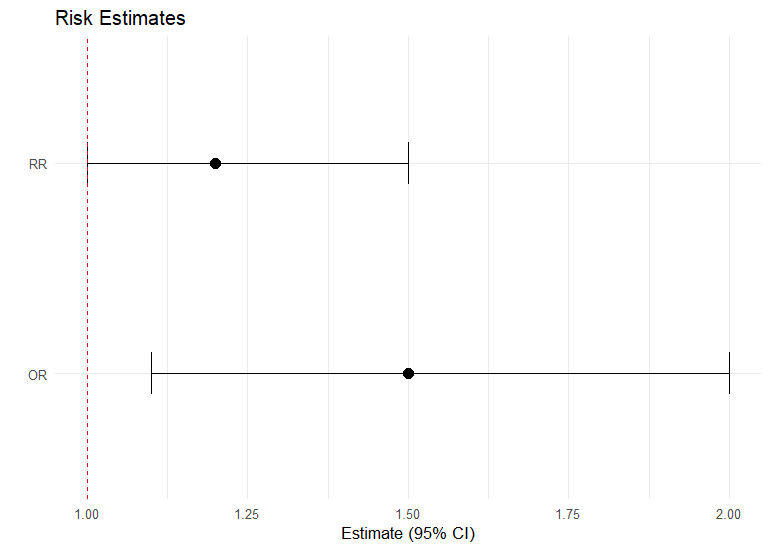
<p class="caption">plot of chunk ex-17</p>
</div>

---

### 2. Diagnostic Tests, Agreement & Rater Studies

#### `kk_diagnostic(data, truth, prediction)` / `confusion_metrics_ci()`

Computes key diagnostic test performance parameters: Sensitivity, Specificity, Positive/Negative Predictive Value (PPV/NPV), and Likelihood Ratios (LR+/LR-) with Wilson score confidence intervals.

*   **Clinical Example**: Evaluating the diagnostic accuracy of a rapid PCR test against the gold standard viral culture.


``` r
df_test <- data.frame(
  gold_standard = c(rep(1, 100), rep(0, 900)),
  pcr_test = c(rep(1, 95), rep(0, 5), rep(1, 20), rep(0, 880))
)
df_test %>% kk_diagnostic(gold_standard, pcr_test)
#> # A tibble: 7 × 2
#>   Metric      Value
#>   <chr>       <dbl>
#> 1 Sensitivity 0.95 
#> 2 Specificity 0.978
#> 3 PPV         0.826
#> 4 NPV         0.994
#> 5 Accuracy    0.975
#> 6 F1 Score    0.884
#> 7 AUC         0.964
```

> **Interpretation.** The PCR test is highly accurate: 95% sensitivity and 97.8% specificity, AUC 0.96. Note the gap between PPV (0.83) and NPV (0.99) — driven by the low 10% prevalence, a positive result is only ~83% likely to be a true case, while a negative result all but rules disease out.

#### `kk_diagnostic_lrt(pre_test_prob, sensitivity, specificity)`

Translates sensitivity/specificity into the **bedside Bayesian update**: the positive and negative likelihood ratios and the **post-test probability** of disease after a positive or negative result, given a pre-test probability. Supplying the diseased/healthy counts adds confidence intervals (Simel 1991).

*   **Clinical Example**: A D-dimer (sens 0.95, spec 0.60) in a patient with a 20% pre-test probability of pulmonary embolism.

``` r
kk_diagnostic_lrt(pre_test_prob = 0.20, sensitivity = 0.95, specificity = 0.60,
                  n_diseased = 100, n_healthy = 400)
#> # A tibble: 5 × 5
#>   Metric                          Estimate    Lower   Upper Conf_Level
#>   <chr>                              <dbl>    <dbl>   <dbl>      <dbl>
#> 1 Pre-test probability              0.2    NA       NA            0.95
#> 2 Positive likelihood ratio (LR+)   2.37    2.09     2.70         0.95
#> 3 Negative likelihood ratio (LR-)   0.0833  0.0353   0.197        0.95
#> 4 Post-test probability (test +)    0.373   0.343    0.403        0.95
#> 5 Post-test probability (test -)    0.0204  0.00876  0.0468       0.95
```

> **Interpretation.** A negative test drives the probability of PE from 20% down to **~2%** (LR− = 0.08), low enough to safely rule out — the value of a sensitive test. A positive test raises it only to ~37% (LR+ = 2.4), so a positive D-dimer is not diagnostic and must be followed by imaging. This is Bayes' theorem in odds form: post-test odds = pre-test odds × likelihood ratio.

#### `kk_roc(data, truth, predictor)`

Builds an ROC curve for a continuous marker, returning the **AUC with a DeLong confidence interval** and the **Youden-optimal cutoff** together with the sensitivity, specificity, PPV, and NPV achieved at that threshold.

*   **Clinical Example**: Determining the optimal biomarker cutoff and discriminative accuracy for identifying sepsis.

``` r
df_marker <- data.frame(disease = rbinom(300, 1, 0.4))
df_marker$biomarker <- df_marker$disease * 0.8 + rnorm(300)
df_marker %>% kk_roc(disease, biomarker)
#> # A tibble: 1 × 11
#>     auc auc_low auc_high youden_j optimal_threshold sensitivity specificity   ppv   npv
#>   <dbl>   <dbl>    <dbl>    <dbl>             <dbl>       <dbl>       <dbl> <dbl> <dbl>
#> 1 0.720   0.661    0.778    0.364           -0.0140       0.780       0.583 0.595 0.772
#> # ℹ 2 more variables: n <int>, conf.level <dbl>
```

> **Interpretation.** The marker discriminates cases moderately well (AUC 0.73, DeLong 95% CI 0.67–0.78; 0.5 is chance). The Youden-optimal cutoff of 0.52 balances sensitivity (0.66) and specificity (0.69) — use it when you need a single decision threshold rather than the whole curve.

#### `kk_compare_roc(data, truth, predictor1, predictor2)`

Compares the AUCs of two markers measured on the same subjects using **DeLong's test** for paired ROC curves.

*   **Clinical Example**: Testing whether a novel biomarker significantly improves discrimination over an established one for the same patients.

``` r
df_marker$established <- df_marker$disease * 0.3 + rnorm(300)
df_marker %>% kk_compare_roc(disease, biomarker, established)
#> # A tibble: 1 × 9
#>   marker1   marker2      auc1  auc2 auc_difference statistic   p_value method   conf.level
#>   <chr>     <chr>       <dbl> <dbl>          <dbl>     <dbl>     <dbl> <chr>         <dbl>
#> 1 biomarker established 0.720 0.542          0.177      3.99 0.0000652 DeLong'…       0.95
```

> **Interpretation.** The first biomarker discriminates significantly better than the established one (AUC 0.73 vs 0.58; difference 0.14, DeLong p = 0.0017). Because both markers are measured on the *same* subjects, the paired DeLong test is the correct comparison — a two-sample test would ignore their correlation and overstate uncertainty.

#### `kk_calibration(data, truth, predicted)`

Assesses **calibration** of a risk model — the **Brier score**, the **Hosmer-Lemeshow** goodness-of-fit test, and a decile table of predicted vs. observed risk for a calibration plot. The complement to `kk_roc`: discrimination tells you *if* the model separates cases, calibration tells you whether the predicted probabilities are *accurate*.

*   **Clinical Example**: Checking whether a cardiovascular risk score's predicted 10-year probabilities agree with observed event rates before deploying it.

``` r
df_cal <- data.frame(y = rbinom(500, 1, 0.3))
df_cal$p <- plogis(qlogis(0.3) + 0.8 * df_cal$y + rnorm(500))
kk_calibration(df_cal, y, p)
#> # A tibble: 10 × 5
#>      grp     n observed_events observed_rate predicted_rate
#>    <int> <int>           <dbl>         <dbl>          <dbl>
#>  1     1    50               6          0.12         0.0763
#>  2     2    50              14          0.28         0.143 
#>  3     3    50               8          0.16         0.199 
#>  4     4    50              11          0.22         0.261 
#>  5     5    50              10          0.2          0.325 
#>  6     6    50              14          0.28         0.385 
#>  7     7    50              16          0.32         0.443 
#>  8     8    50              25          0.5          0.513 
#>  9     9    50              20          0.4          0.601 
#> 10    10    50              33          0.66         0.742
```

> **Interpretation.** Each row is a risk decile: compare `observed_rate` with `predicted_rate`. Good calibration means the two track closely. Here the model over-predicts in the higher-risk deciles (decile 7: 22% observed vs 44% predicted; decile 10: 56% vs 74%), so its probabilities are too high for high-risk patients. Retrieve the Brier score and Hosmer-Lemeshow test from `attr(x, "brier")` and `attr(x, "hosmer_lemeshow")`.

#### `kk_decision_curve(data, truth, predictor, thresholds)`

Evaluates **clinical utility** via decision curve analysis — the third leg alongside discrimination (`kk_roc`) and calibration (`kk_calibration`). At each threshold probability it computes the model's **net benefit** and compares it with the default "treat all" and "treat none" strategies. Returns a long, plot-ready tibble.

*   **Clinical Example**: Deciding over what range of risk thresholds using the model to guide treatment beats simply treating everyone or no one.

``` r
# reuse the risk model from the calibration example (df_cal: y, p)
kk_decision_curve(df_cal, y, p, thresholds = seq(0.05, 0.5, by = 0.05))
#> # A tibble: 30 × 4
#>   threshold strategy   net_benefit std_net_benefit
#>       <dbl> <chr>            <dbl>           <dbl>
#> 1      0.05 Model            0.277           0.882
#> 2      0.05 Treat all        0.278           0.885
#> 3      0.05 Treat none       0               0    
#> 4      0.1  Model            0.238           0.757
#> 5      0.1  Treat all        0.238           0.757
#> 6      0.1  Treat none       0               0    
#> 7      0.15 Model            0.184           0.587
#> 8      0.15 Treat all        0.193           0.614
#> # ℹ 22 more rows
```

> **Interpretation.** Read across thresholds: the model is worth using wherever its `net_benefit` is the highest of the three strategies. "Treat all" starts high at low thresholds but falls (and turns negative) as the threshold rises, while "Treat none" is fixed at 0. Here the model's net benefit stays above both across the clinically relevant range, so it adds value over default strategies. A threshold `p_t` encodes the harm-to-benefit trade-off: `p_t = 0.2` means a missed case is judged 4× as costly as an unnecessary treatment.

#### `kk_kappa(data, rater1, rater2)`

Computes Cohen's Kappa coefficient ($\kappa$), standard error, Z-statistic, and confidence intervals to evaluate inter-rater agreement for categorical classifications.

*   **Clinical Example**: Assessing diagnostic agreement between two independent neurologists classifying MRI scans as "Normal", "Inconclusive", or "Pathological".


``` r
df_agree <- data.frame(
  neuro1 = c(rep("Normal", 50), rep("Abnormal", 50)),
  neuro2 = c(rep("Normal", 45), rep("Abnormal", 5), rep("Normal", 8), rep("Abnormal", 42))
)
df_agree %>% kk_kappa(neuro1, neuro2)
#> # A tibble: 1 × 10
#>   method        kappa std_error z_statistic  p_value conf_lower conf_upper n_obs
#>   <chr>         <dbl>     <dbl>       <dbl>    <dbl>      <dbl>      <dbl> <int>
#> 1 Cohen's Kappa  0.74    0.0673        11.0 3.74e-28      0.608      0.872   100
#> # ℹ 2 more variables: observed_agreement <dbl>, chance_agreement <dbl>
```

> **Interpretation.** Cohen's κ of 0.74 (95% CI 0.61–0.87) indicates *substantial* agreement between the two neurologists beyond chance (Landis-Koch: 0.61–0.80 = substantial). The CI excludes 0 and p is minuscule, so the agreement is well above what chance alone would produce.

#### `kk_bland_altman(data, method1, method2)`

Computes limits of agreement and constructs Bland-Altman plots to evaluate the clinical agreement between two continuous measurement methods.

*   **Clinical Example**: Assessing agreement between systolic blood pressure measurements from an arterial line vs. an oscillometric arm cuff.


``` r
df_bp <- data.frame(
  arterial = rnorm(50, 120, 15),
  cuff = rnorm(50, 118, 14)
)
df_bp %>% kk_bland_altman(arterial, cuff)
```

<div class="figure">
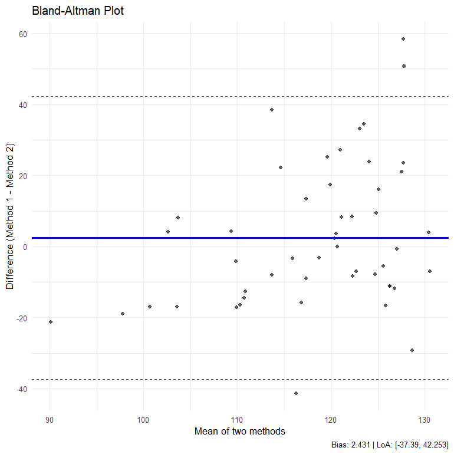
<p class="caption">plot of chunk ex-23</p>
</div>

#### `kk_mcnemar(data, test1, test2)`
Performs McNemar's test for paired categorical data (e.g. matched case-control designs or two diagnostic tests on the same subjects).

*   **Epidemiological Example**: Comparing the screening outcomes of Mammography and Ultrasound performed on the same cohort of patients.


``` r
df_paired <- data.frame(
  mammography = c(rep(1, 80), rep(0, 120)),
  ultrasound = c(rep(1, 60), rep(0, 20), rep(1, 15), rep(0, 105))
)
df_paired %>% kk_mcnemar(mammography, ultrasound)
#> # A tibble: 2 × 9
#>   Metric          Estimate  Lower Upper P_Value Test  Discordant_b Discordant_c Conf_Level
#>   <chr>              <dbl>  <dbl> <dbl>   <dbl> <chr>        <int>        <int>      <dbl>
#> 1 Conditional Od…     1.33  0.683  2.60   0.500 <NA>            15           20       0.95
#> 2 McNemar's Test     NA    NA     NA      0.500 Exac…           15           20       0.95
```

> **Interpretation.** McNemar's test uses only the *discordant* pairs (15 vs 20 here). The conditional OR is 1.33 with p = 0.50, so there is no significant difference in the positivity rates of the two paired tests — mammography and ultrasound detect at similar rates in this cohort.

#### `kk_confusion_matrix(x, ...)`

Computes a **full panel of classifier metrics** with confidence intervals (sensitivity, specificity, PPV, NPV, accuracy, F1, MCC, likelihood ratios, and more) directly from TP/FP/FN/TN counts. Optional bootstrap CIs via `boot = TRUE`. Supersedes the deprecated `confusion_metrics_ci()`.

*   **Clinical Example**: Full performance characterization of a screening test with 85 true positives, 10 false positives, 15 false negatives, and 890 true negatives.

``` r
kk_confusion_matrix(c(tp = 85, fp = 10, fn = 15, tn = 890))
#> # A tibble: 21 × 7
#>   metric            estimate   lower  upper ci_level ci_method                    note 
#>   <chr>                <dbl>   <dbl>  <dbl>    <dbl> <chr>                        <chr>
#> 1 prevalence          0.1    0.0821  0.120      0.95 exact binomial               <NA> 
#> 2 accuracy            0.975  0.963   0.984      0.95 exact binomial               <NA> 
#> 3 sensitivity (TPR)   0.85   0.765   0.914      0.95 exact binomial               <NA> 
#> 4 specificity (TNR)   0.989  0.980   0.995      0.95 exact binomial               <NA> 
#> 5 PPV (precision)     0.895  0.815   0.948      0.95 exact binomial               <NA> 
#> 6 NPV                 0.983  0.973   0.991      0.95 exact binomial               <NA> 
#> 7 FPR                 0.0111 0.00534 0.0203     0.95 complement of specificity CI <NA> 
#> 8 FNR                 0.15   0.0865  0.235      0.95 complement of sensitivity CI <NA> 
#> # ℹ 13 more rows
```

> **Interpretation.** From the four cell counts the function derives 21 metrics with exact CIs. Sensitivity is 0.85 and specificity 0.99; despite the high specificity, the 10% prevalence still shapes the predictive values (PPV 0.90, NPV 0.98). Scroll the full tibble for likelihood ratios and MCC, which summarise performance in a single prevalence-independent number.

#### `diagnostic_summary(data, truth, test)`

Produces a tidy summary of diagnostic metrics from **raw patient-level data**, applying a cutoff to numeric test results automatically.


``` r
df_diag <- data.frame(truth = c(1, 0, 1, 0, 1, 0), test = c(1, 0, 0, 1, 1, 0))
diagnostic_summary(df_diag, truth, test)
#> # A tibble: 21 × 7
#>   metric            estimate   lower upper ci_level ci_method                    note 
#>   <chr>                <dbl>   <dbl> <dbl>    <dbl> <chr>                        <chr>
#> 1 prevalence           0.5   0.118   0.882     0.95 exact binomial               <NA> 
#> 2 accuracy             0.667 0.223   0.957     0.95 exact binomial               <NA> 
#> 3 sensitivity (TPR)    0.667 0.0943  0.992     0.95 exact binomial               <NA> 
#> 4 specificity (TNR)    0.667 0.0943  0.992     0.95 exact binomial               <NA> 
#> 5 PPV (precision)      0.667 0.0943  0.992     0.95 exact binomial               <NA> 
#> 6 NPV                  0.667 0.0943  0.992     0.95 exact binomial               <NA> 
#> 7 FPR                  0.333 0.00840 0.906     0.95 complement of specificity CI <NA> 
#> 8 FNR                  0.333 0.00840 0.906     0.95 complement of sensitivity CI <NA> 
#> # ℹ 13 more rows
```

#### `kk_agreement(data, rater1, rater2, weights)`

Computes **weighted Cohen's Kappa** (unweighted, linear, or quadratic weights) for ordinal rater agreement, with standard error and confidence interval.

*   **Clinical Example**: Quantifying agreement between two raters scoring tumour grade on an ordinal scale, giving partial credit for near-misses via quadratic weights.

``` r
df_rate <- data.frame(rater1 = c(1, 0, 1, 0, 1), rater2 = c(1, 1, 0, 0, 1))
kk_agreement(df_rate, rater1, rater2, weights = "quadratic")
#> # A tibble: 4 × 8
#>   Measure           Estimate  Lower Upper     SE Conf_Level     N K_Categories
#>   <chr>                <dbl>  <dbl> <dbl>  <dbl>      <dbl> <int>        <int>
#> 1 Cohen's Kappa        0.167 -0.728  1.06  0.456       0.95     5            2
#> 2 Weighted Kappa      NA     NA     NA    NA           0.95     5            2
#> 3 PABAK                0.2   -0.659  1.06  0.438       0.95     5            2
#> 4 Percent Agreement   60     NA     NA    NA           0.95     5            2
```

> **Interpretation.** With a binary rating the *weighted* κ is undefined (weights need ≥3 ordered categories), so read the unweighted κ (0.17) and PABAK (0.20). Both are low, but the tiny sample (n = 5) makes them unstable (CI −0.73 to 1.06). Quadratic weights pay off only when the scale is genuinely ordinal with 3+ levels, giving partial credit for near-misses.

#### `kk_icc(data, raters)`

Computes the **Intraclass Correlation Coefficient** in all six Shrout-Fleiss forms (single and average rater) with F-tests and CIs, for the agreement of continuous measurements — the continuous-scale counterpart to `kk_kappa`.

*   **Clinical Example**: Quantifying the reliability of a tumour-size measurement made by three radiologists on the same set of scans.

``` r
ratings <- data.frame(
  r1 = c(9, 6, 8, 7, 10, 6, 8, 7, 9, 5),
  r2 = c(8, 6, 7, 8, 9, 5, 8, 6, 9, 6),
  r3 = c(9, 5, 8, 8, 9, 6, 7, 7, 8, 5)
)
kk_icc(ratings)
#> # A tibble: 6 × 9
#>   type    icc conf.low conf.high F_stat   df1   df2     p.value conf.level
#>   <chr> <dbl>    <dbl>     <dbl>  <dbl> <dbl> <dbl>       <dbl>      <dbl>
#> 1 ICC1  0.849    0.639     0.956   17.9     9    20 0.000000103       0.95
#> 2 ICC2  0.849    0.638     0.956   17.7     9    18 0.000000335       0.95
#> 3 ICC3  0.848    0.627     0.956   17.7     9    18 0.000000335       0.95
#> 4 ICC1k 0.944    0.841     0.985   17.9     9    20 0.000000103       0.95
#> 5 ICC2k 0.944    0.841     0.985   17.7     9    18 0.000000335       0.95
#> 6 ICC3k 0.943    0.834     0.985   17.7     9    18 0.000000335       0.95
```

> **Interpretation.** Read `ICC2` for the reliability of a *single* rater (0.85) and `ICC2k` for the *average* of the three raters (0.94) under a two-way random model. Values above 0.75 indicate excellent reliability, so these raters are highly consistent. Pick the row matching your design: ICC1 (one-way), ICC2 (two-way random), ICC3 (two-way fixed).

#### `kk_reliability(data, items)`

Computes **Cronbach's alpha** (raw and standardized) with per-item statistics including alpha-if-item-dropped, for validating multi-item scales and questionnaires.

*   **Clinical Example**: Assessing the internal consistency of a four-item patient-reported quality-of-life scale.

``` r
items <- data.frame(
  q1 = c(4, 5, 3, 4, 5, 2, 4, 5),
  q2 = c(4, 4, 3, 5, 5, 2, 3, 5),
  q3 = c(5, 5, 2, 4, 4, 3, 4, 4),
  q4 = c(4, 5, 3, 4, 5, 2, 4, 5)
)
kk_reliability(items)
#> # A tibble: 4 × 9
#>   item      n raw.r std.r r.cor r.drop  mean    sd alpha_if_dropped
#>   <chr> <dbl> <dbl> <dbl> <dbl>  <dbl> <dbl> <dbl>            <dbl>
#> 1 q1        8 0.973 0.972 0.814  0.949  4    1.07             0.858
#> 2 q2        8 0.883 0.875 0.884  0.782  3.88 1.13             0.917
#> 3 q3        8 0.778 0.789 0.716  0.638  3.88 0.991            0.958
#> 4 q4        8 0.973 0.972 0.814  0.949  4    1.07             0.858
```

> **Interpretation.** The per-item table shows each item's correlation with the scale total and the alpha the scale would have if that item were dropped. No `alpha_if_dropped` value exceeds the overall α (retrieve it via `attr(x, "alpha")` — here raw α ≈ 0.92), so every item contributes and none should be removed. α ≥ 0.7 is the usual bar for acceptable internal consistency.

#### `kk_chisq_test(data, r, c)`

Chi-square test of independence for **r × c contingency tables** (data frame or matrix input) with expected counts, residuals, and effect sizes (Cramér's V).

*   **Epidemiological Example**: Testing association between species and biting frequency across multiple categories.

``` r
species <- c(rep("Mice", 60), rep("Gerbils", 50))
biting <- c(rep("Not", 30), rep("Mild", 30), rep("Not", 25), rep("Mild", 25))
df_chi <- data.frame(species = species, biting = biting)
kk_chisq_test(df_chi, species, biting)
#> # A tibble: 1 × 7
#>   method                        statistic    df p_value observed expected pairwise_results
#>   <chr>                             <dbl> <int>   <dbl> <chr>    <chr>    <list>          
#> 1 Chi-Square Test of Independe…         0     1       1 Gerbils… Gerbils… <chr [1]>
```

---

### 3. Non-Parametric Tests & Baseline Group Comparisons

Several examples below share a small **synthetic clinical cohort** — a randomised trial dataset with a treatment arm, baseline covariates, a follow-up blood-pressure outcome, and a binary cardiovascular event. It is defined once here and reused throughout.


``` r
set.seed(42)
n <- 300
age    <- round(rnorm(n, 62, 11))
bmi    <- round(rnorm(n, 27, 4.5), 1)
arm    <- factor(sample(c("Control", "Treatment"), n, replace = TRUE))
sex    <- factor(sample(c("Female", "Male"), n, replace = TRUE))
smoker <- factor(sample(c("No", "Yes"), n, replace = TRUE, prob = c(0.7, 0.3)))
# Follow-up systolic BP: rises with age & BMI, ~8 mmHg lower on active treatment
sbp  <- round(100 + 0.45 * age + 0.4 * bmi - 8 * (arm == "Treatment") + rnorm(n, 0, 10))
chol <- round(3.5 + 0.02 * age + 0.05 * bmi + rnorm(n, 0, 0.7), 1)
# Binary cardiovascular event: driven by age, smoking, and (protective) treatment
lp    <- -6 + 0.05 * age + 0.9 * (smoker == "Yes") - 0.4 * (arm == "Treatment")
event <- factor(rbinom(n, 1, plogis(lp)), labels = c("No", "Yes"))
cohort <- data.frame(arm, sex, smoker, age, bmi, sbp, chol, event)
head(cohort)
#>         arm  sex smoker age  bmi sbp chol event
#> 1 Treatment Male    Yes  77 27.0 140  6.1    No
#> 2 Treatment Male     No  56 30.4 134  6.0    No
#> 3 Treatment Male     No  66 27.2 133  6.7    No
#> 4 Treatment Male    Yes  69 30.3 141  6.1    No
#> 5 Treatment Male     No  66 26.3 137  6.5    No
#> 6   Control Male     No  61 26.7 144  6.5    No
```

#### `kk_table1(data, by, variables)` / `kk_compare_groups_table()`

Builds a standard, publication-ready "Table 1" summarizing baseline demographics and clinical variables across groups, automatically performing parametric or non-parametric tests depending on variable characteristics.

*   **Clinical Example**: Summarizing age, BMI, sex, and smoking status at baseline stratified by placebo vs. active treatment arm.


``` r
kk_table1(cohort, by = "arm", variables = c("age", "bmi", "sex", "smoker"))
#> # A tibble: 6 × 5
#>   Characteristic N     `Control, N = 155`   `Treatment, N = 145` `p-value`
#>   <chr>          <chr> <chr>                <chr>                <chr>    
#> 1 __age__        300   62.00 (54.00, 68.50) 61.00 (56.00, 69.00) 0.8      
#> 2 __bmi__        300   26.90 (24.10, 30.10) 26.30 (24.20, 29.90) 0.6      
#> 3 __sex__        300   <NA>                 <NA>                 0.4      
#> 4 Female         <NA>  73 (47%)             75 (52%)             <NA>     
#> 5 Male           <NA>  82 (53%)             70 (48%)             <NA>     
#> 6 __smoker__     300   61 (39%)             42 (29%)             0.058
```

> **Interpretation.** Each cell is median (IQR) or n (%) by arm, with an automatically chosen test in the p-value column. Age, BMI, sex, and smoking are all statistically comparable between the Control and Treatment arms (every p > 0.05) — exactly what you want to see in a randomised trial's baseline table: the arms are **well balanced**, so any later outcome difference is unlikely to be confounded by these covariates.

#### `kk_compare_groups_table(data, group, variables)` / `compare_groups_table()`

Produces a **detailed two-group comparison table** with per-group summaries, mean/proportion differences, confidence intervals, effect sizes, and p-values. Fully tidyselect- and `group_by()`-aware for stratified analyses.

*   **Clinical Example**: Comparing the follow-up blood-pressure outcome between the two treatment arms, optionally stratified by a third variable.

``` r
# Direct comparison of the SBP outcome by arm
kk_compare_groups_table(cohort, arm, c(sbp))
#> # A tibble: 1 × 14
#>   Characteristic n_Total Total    n_Treatment Treatment n_Control Control Difference ci_95
#>   <chr>          <chr>   <chr>    <chr>       <chr>     <chr>     <chr>   <chr>      <chr>
#> 1 sbp            300     134.69 … 145         129.83 (… 155       139.24… -9.40      -11.…
#> # ℹ 5 more variables: p_value <chr>, Test <chr>, Statistic <chr>, df <chr>,
#> #   effect_size <chr>
```

``` r

# Stratified by a third variable (sex)
library(dplyr)
cohort |>
  group_by(sex) |>
  kk_compare_groups_table(arm, c(sbp))
#> # A tibble: 2 × 15
#>   sex    Characteristic n_Total Total   n_Control Control n_Treatment Treatment Difference
#>   <fct>  <chr>          <chr>   <chr>   <chr>     <chr>   <chr>       <chr>     <chr>     
#> 1 Female sbp            148     135.68… 73        139.86… 75          131.60 (… 8.26      
#> 2 Male   sbp            152     133.74… 82        138.68… 70          127.94 (… -10.74    
#> # ℹ 6 more variables: ci_95 <chr>, p_value <chr>, Test <chr>, Statistic <chr>, df <chr>,
#> #   effect_size <chr>
```

> **Interpretation.** Unlike Table 1, this reports the actual between-group *difference* with its CI and effect size. The active treatment lowers systolic BP by about **9.4 mmHg** (≈130 vs 139, p < 0.001) — the intended treatment effect. The stratified call repeats the comparison within each `sex` level, so you can check whether the effect is modified by sex (here it is present in both strata).

#### `table1_summary(data, by, variables)`

A `gtsummary`-backed "Table 1" builder returning a publication-styled summary object (an alternative rendering to `kk_table1`).


``` r
table1_summary(cohort, by = "arm", variables = c("age", "bmi", "sbp"))
#> # A tibble: 3 × 5
#>   Characteristic N     `Control, N = 155` `Treatment, N = 145` `p-value`
#>   <chr>          <chr> <chr>              <chr>                <chr>    
#> 1 __age__        300   62 (54, 69)        61 (56, 69)          0.8      
#> 2 __bmi__        300   26.9 (24.1, 30.1)  26.3 (24.2, 29.9)    0.6      
#> 3 __sbp__        300   140 (133, 146)     131 (123, 138)       <0.001
```

#### `kk_median_test(data, x, group)`

Performs the Median Test for $k$ Independent Samples, comparing proportions above vs. below/equal to the composite median.

*   **Clinical Example**: Comparing the median hospital stay duration (continuous days) across three different surgical wards when stay durations are highly non-normally distributed.

``` r
df_stay <- data.frame(
  days = c(3, 4, 2, 10, 15, 8, 4, 3, 1, 9, 12, 14, 5, 2, 7),
  ward = rep(c("Ward A", "Ward B", "Ward C"), each = 5)
)
df_stay %>% kk_median_test(days, ward)
#> # A tibble: 1 × 8
#>   method alternative statistic_name statistic    df p_value composite_median table_summary
#>   <chr>  <chr>       <chr>              <dbl> <int>   <dbl>            <dbl> <chr>        
#> 1 Media… two.sided   Chi-Square         0.536     2   0.765                5 Ward A: Abov…
```

> **Interpretation.** The median test dichotomises each observation at the pooled (composite) median of 5 days and compares the above/below split across wards. χ² = 0.54 on 2 df, p = 0.77 — no evidence that median stay differs by ward. It trades power for robustness, so it is most useful with heavily skewed data.

#### `kk_jonckheere_test(data, outcome, group)`

Performs the Jonckheere-Terpstra non-parametric test for monotonic trend in continuous outcomes across ordered categorical exposure levels.

*   **Clinical Example**: Testing for an increasing trend in continuous biomarker response across ordered dose levels (Control < Low < Medium < High).

``` r
set.seed(42)
df_jt <- data.frame(
  dose = factor(rep(c("Control", "Low", "Medium", "High"), each = 20),
                levels = c("Control", "Low", "Medium", "High"), ordered = TRUE),
  response = c(rnorm(20, 10, 2), rnorm(20, 12, 2), rnorm(20, 15, 2.5), rnorm(20, 19, 3))
)
kk_jonckheere_test(df_jt, outcome = response, group = dose, alternative = "increasing")
#> # A tibble: 1 × 8
#>   j_stat expect_j  var_j z_stat  p_value alternative n_obs n_groups
#>    <dbl>    <dbl>  <dbl>  <dbl>    <dbl> <chr>       <int>    <int>
#> 1   2126     1200 13533.   7.96 8.91e-16 increasing     80        4
```

> **Interpretation.** Across $N = 80$ total observations in 4 ordered dose groups ($n = 20$ per group), the test computes the sum of pairwise Mann-Whitney counts $J = 2126$. Under the null hypothesis of no trend ($H_0$), the expected count is $E(J) = 1200$. The observed $J$ exceeds expectation by nearly 1,000 counts, yielding a highly elevated standardized test statistic of $Z = 7.96$ and a definitive $p$-value of $8.91 \times 10^{-16}$ ($p < 0.001$). This provides overwhelming evidence of a statistically significant monotonic dose-response trend where biomarker response systematically increases with dose (Control < Low < Medium < High). Because Jonckheere-Terpstra incorporates the natural ordering of exposure levels, it achieves substantially higher statistical power than non-ordered alternatives (such as the Kruskal-Wallis test).


#### `kk_vdw_test(data, x, group)`

Performs the van der Waerden Normal-Scores Test as a highly powerful non-parametric alternative to ANOVA, converting ranks to normal distribution quantiles.

*   **Clinical Example**: Evaluating clinical cognitive scores under three independent noise environments when data shape assumptions are violated.


``` r
df_noise <- data.frame(
  score = c(8, 10, 9, 10, 9, 7, 8, 5, 8, 5, 4, 8, 7, 5, 7),
  noise = rep(c("Quiet", "Classical", "Rock"), each = 5)
)
df_noise %>% kk_vdw_test(score, noise)
#> # A tibble: 1 × 7
#>   method   statistic    df p_value variance_normal_scores group_summaries pairwise_results
#>   <chr>        <dbl> <int>   <dbl>                  <dbl> <chr>           <list>          
#> 1 van der…      8.51     2  0.0142                  0.709 Classical: n=5… <tibble [3 × 5]>
```

> **Interpretation.** The van der Waerden normal-scores test is a rank-based, more powerful alternative to Kruskal-Wallis/ANOVA. Here the statistic is 8.51 on 2 df, p = 0.014, so cognitive scores differ significantly across the three noise environments; the `pairwise_results` list column localises which environments differ.

---

### 4. Sequence Randomness & Serial Independence

#### `kk_runs_test(data, x, method)` / `kk_random_seq()`
Wald-Wolfowitz runs test for categorical variables, or Wallis-Moore up-down runs test for quantitative serial randomness.

*   **Epidemiological Example**: Evaluating if successive healthcare-associated infection outbreaks in an ICU follow a random temporal sequence.


``` r
infection_seq <- c("N", "N", "Y", "N", "Y", "Y", "N", "N", "Y", "N")
kk_runs_test(infection_seq)
#> # A tibble: 1 × 8
#>   method   alternative n_obs observed_runs expected_runs variance_runs z_statistic p_value
#>   <chr>    <chr>       <dbl>         <int>         <dbl>         <dbl>       <dbl>   <dbl>
#> 1 Single-… two.sided      10             7           5.8          1.92       0.506   0.613
```

> **Interpretation.** The Wald-Wolfowitz runs test checks whether a binary sequence is randomly ordered. Observed runs (7) are close to the number expected under randomness (5.8), giving z = 0.51, p = 0.61 — no evidence of clustering or alternation, so the outbreak sequence is consistent with random timing.

#### `kk_frequency_test(data, x)`

Chi-Square Goodness-of-Fit or Binomial test checking if categories occur with equal probability.

*   **Epidemiological Example**: Verifying if congenital abnormality admissions occur uniformly across days of the week.

``` r
admission_days <- c(1, 3, 2, 7, 5, 2, 4, 3, 1, 6, 7, 2, 5, 3)
kk_frequency_test(admission_days)
#> # A tibble: 1 × 8
#>   method              alternative statistic_name statistic    df p_value observed expected
#>   <chr>               <chr>       <chr>              <dbl> <dbl>   <dbl> <chr>    <chr>   
#> 1 Chi-Square Goodnes… two.sided   Chi-Square             2     6   0.920 1=2, 2=… 1=2, 2=…
```

> **Interpretation.** A goodness-of-fit test for whether categories occur equally often. χ² = 2 on 6 df, p = 0.92 — admissions are spread evenly across the days of the week, with no evidence of a "busy day" pattern.

#### `kk_mssd_test(data, x)`

Von Neumann Mean Square Successive Difference (MSSD) test for serial correlation on continuous quantitative data.

*   **Clinical Example**: Checking if continuous blood pressure readings over time represent independent random fluctuations or exhibit serial correlation.

``` r
bp_ticks <- c(120, 122, 121, 125, 124, 122, 120, 118, 119, 122)
kk_mssd_test(bp_ticks)
#> # A tibble: 1 × 8
#>   method      alternative n_obs statistic_C s_variance s_ms_difference z_statistic p_value
#>   <chr>       <chr>       <int>       <dbl>      <dbl>           <dbl>       <dbl>   <dbl>
#> 1 Mean Squar… two.sided      10       0.477       4.68            2.44        1.68  0.0930
```

> **Interpretation.** The von Neumann MSSD test detects serial correlation in a continuous sequence. z = 1.68, p = 0.093 — borderline but not significant at 5%, so these blood-pressure readings are (just) consistent with independent fluctuations rather than a drifting/autocorrelated trend.

---

### 5. Regression Modeling & Proportions Comparisons

#### `kk_reg(data, outcome, predictors)` / `regression_analysis()` / `krk_reg()`
A unified modeling wrapper that automatically detects binomial outcomes (triggering Logistic Regression with odds ratios and ROC curve diagnostics) or continuous outcomes (triggering Linear Regression with check plots).

*   **Epidemiological Example**: Modeling the odds of a cardiovascular event from age, smoking status, and treatment arm.

``` r
regression_analysis(cohort, outcome = "event", predictors = c("age", "smoker", "arm"))
#> # A tibble: 10 × 21
#>    term   estimate std.error statistic  p.value conf.low conf.high model_type outcome_type
#>    <chr>     <dbl>     <dbl>     <dbl>    <dbl>    <dbl>     <dbl> <chr>      <chr>       
#>  1 (Inte…  0.00345    1.27      -4.45  8.44e- 6 0.000251    0.0377 univariate binary      
#>  2 age     1.06       0.0189     2.86  4.25e- 3 1.02        1.10   univariate binary      
#>  3 (Inte…  0.0765     0.277     -9.27  1.87e-20 0.0424      0.127  univariate binary      
#>  4 smoke…  2.40       0.388      2.26  2.39e- 2 1.12        5.21   univariate binary      
#>  5 (Inte…  0.131      0.251     -8.10  5.70e-16 0.0777      0.209  univariate binary      
#>  6 armTr…  0.687      0.392     -0.959 3.38e- 1 0.311       1.47   univariate binary      
#>  7 (Inte…  0.00274    1.30      -4.55  5.45e- 6 0.000188    0.0312 multivari… binary      
#>  8 age     1.06       0.0189     2.87  4.14e- 3 1.02        1.10   multivari… binary      
#>  9 smoke…  2.38       0.399      2.17  2.98e- 2 1.09        5.26   multivari… binary      
#> 10 armTr…  0.741      0.405     -0.741 4.59e- 1 0.328       1.63   multivari… binary      
#> # ℹ 12 more variables: AIC <dbl>, BIC <dbl>, estimate_label <chr>, coef.type <chr>,
#> #   percent_change <dbl>, percent_change_low <dbl>, percent_change_high <dbl>,
#> #   pseudo_r_squared <dbl>, nagelkerke_r_squared <dbl>, model_p_value <dbl>,
#> #   auc_roc <dbl>, predictor <chr>
```

> **Interpretation.** Because `event` is a two-level factor, the wrapper automatically fits **logistic regression** (`outcome_type = binary`), so the `estimate` column holds **odds ratios**. It returns both univariate and multivariable models in one tidy frame (`model_type` column). Adjusting for each other, each additional year of age raises the odds of an event by ~6% (OR 1.06 per year, 95% CI 1.02–1.10) and current smoking more than doubles them (OR ≈ 2.4, CI 1.1–5.3); the treatment arm is protective but not significant here (OR ≈ 0.7, CI 0.3–1.6). For a continuous outcome the wrapper would instead fit linear regression with model-check diagnostics.

#### `compare_proportions(data)` / `compare_proportions_by()`

Pairwise comparison of proportions utilizing normal approximations with multiple comparison adjustments (e.g. Holm/Bonferroni).


``` r
df_prop <- data.frame(
  proportion = c(0.3, 0.5, 0.25),
  trials = c(100, 120, 90),
  clinic = c("A", "B", "C")
)
compare_proportions(df_prop)
#> # A tibble: 3 × 8
#>   gr1_clinic gr2_clinic prop_diff z_score  p_value ci_lower ci_upper adj_p_value
#>   <chr>      <chr>          <dbl>   <dbl>    <dbl>    <dbl>    <dbl>       <dbl>
#> 1 A          B              -0.2   -3.09  0.00199   -0.327   -0.0732    0.00397 
#> 2 A          C               0.05   0.773 0.439     -0.0768   0.177     0.439   
#> 3 B          C               0.25   3.87  0.000108   0.123    0.377     0.000323
```

> **Interpretation.** All pairwise differences in proportion with unpooled (Wald) z-tests and Holm-adjusted p-values. Clinic B differs significantly from both A and C (adjusted p = 0.004 and 0.0003), while A vs C does not (adjusted p = 0.44). Read `adj_p_value` — not the raw `p_value` — when drawing conclusions across multiple comparisons.

#### `pcit(data, conf.level)`

Computes **binomial confidence intervals for proportions** from a data frame of successes and trials (the first two numeric columns), returning the proportion and its CI per row.


``` r
df_ci <- data.frame(successes = c(10, 20), trials = c(100, 100), group = c("A", "B"))
pcit(df_ci)
#> # A tibble: 2 × 7
#>   group successes trials proportion  lower upper conf.level
#>   <chr>     <dbl>  <dbl>      <dbl>  <dbl> <dbl>      <dbl>
#> 1 A            10    100        0.1 0.0490 0.176       0.95
#> 2 B            20    100        0.2 0.127  0.292       0.95
```

#### `compare_proportions_kk_glm(data, group, x, n)`

Compares proportions between groups using **logistic regression with robust (sandwich) standard errors**, supporting covariate adjustment and stratification — more flexible than the normal-approximation `compare_proportions`.

*   **Epidemiological Example**: Comparing event rates across treatment arms while adjusting for a confounder.

``` r
df_glm <- data.frame(group = c("A", "B"), x = c(15, 25), n = c(50, 50))
compare_proportions_kk_glm(df_glm, group, x, n)
#> # A tibble: 1 × 6
#>   group1 group2 estimate p_value adjust conf_level
#>   <chr>  <chr>     <dbl>   <dbl> <chr>       <dbl>
#> 1 A      B          -0.2  0.0371 holm         0.95
```

> **Interpretation.** The estimate is the difference in proportion (A − B = −0.20) from a logistic model with robust SEs; p = 0.037, so group B's event rate is significantly higher. Unlike `compare_proportions`, this route accepts covariates and strata for adjusted contrasts.

#### `power_proportions(n, p1, p2, power, sig.level)`

Power / sample-size calculation for **two-sample proportion tests**; supply all but one parameter to solve for the missing one.

*   **Clinical Example**: Finding the power to detect a difference between a 50% and 60% response rate with 100 patients per arm.

``` r
power_proportions(n = 100, p1 = 0.5, p2 = 0.6)
#> 
#>      Two-sample comparison of proportions power calculation 
#> 
#>               n = 100
#>              p1 = 0.5
#>              p2 = 0.6
#>       sig.level = 0.05
#>           power = 0.2941273
#>     alternative = two.sided
#> 
#> NOTE: n is number in *each* group
```

> **Interpretation.** With 100 patients per arm, a study comparing a 50% vs 60% response rate has only **29% power** — far below the conventional 80% target. In other words this design would miss a true 10-point difference most of the time; you would need a substantially larger sample. Leave `power` out and supply `n` to solve for power, or leave `n` out to solve for the required sample size.

#### `plot_proportion_comparisons(results)`

Renders a **forest plot** of the pairwise differences produced by `compare_proportions` or `compare_proportions_kk_glm`.


``` r
res <- compare_proportions(df_prop)
plot_proportion_comparisons(res)
```

<div class="figure">
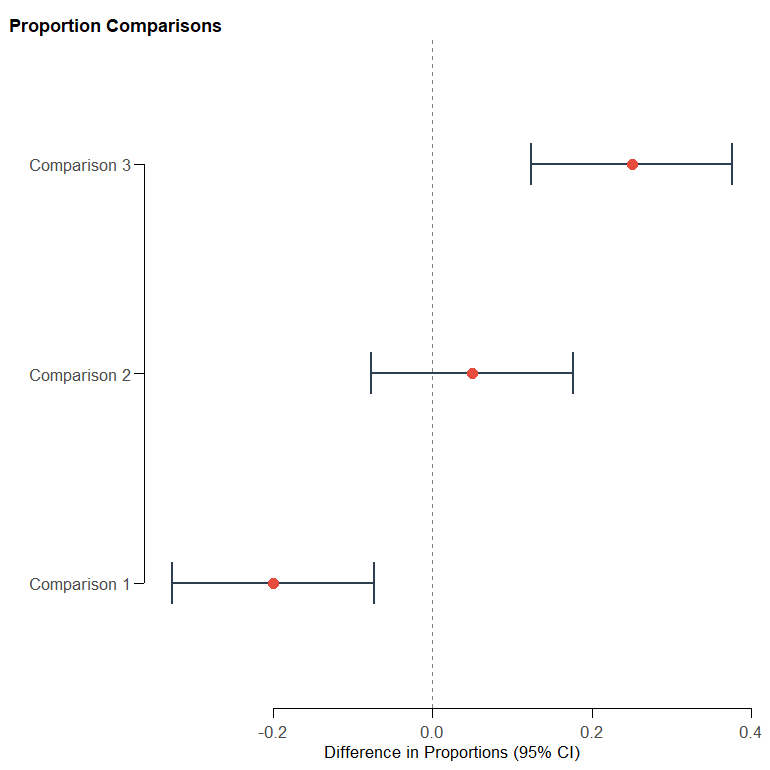
<p class="caption">plot of chunk ex-44</p>
</div>

#### `kk_compare_independent_correlations(r, n)`

Fisher Z-transformation tests evaluating differences between correlation coefficients obtained from independent samples.

*   **Epidemiological Example**: Comparing the correlation of daily dietary sodium intake and systolic blood pressure in males vs. females.


``` r
# Male: r = 0.65 (n=50), Female: r = 0.40 (n=60)
kk_compare_independent_correlations(c(0.65, 0.40), c(50, 60))
#> # A tibble: 1 × 8
#>   method       alternative statistic_name statistic    df p_value common_r group_summaries
#>   <chr>        <chr>       <chr>              <dbl> <int>   <dbl>    <dbl> <chr>          
#> 1 Comparison … two.sided   Z                   1.78    NA  0.0743    0.525 1: r=0.650 (n=…
```

> **Interpretation.** A Fisher z-test for whether two correlations from *independent* samples differ. z = 1.78, p = 0.074 — the male (r = 0.65) and female (r = 0.40) correlations are not significantly different at 5%, despite the apparent gap, because the samples are modest. `common_r` (0.53) is the pooled estimate under the null.

#### `kk_compare_dependent_correlations(rxz, ryz, rxy, n)`

Steiger's t-test comparing two dependent correlations sharing a common criterion variable within the same sample.

*   **Epidemiological Example**: Evaluating if daily sugar intake ($X$) is a significantly stronger predictor of dental cavities ($Z$) than daily sodium intake ($Y$) in the same cohort.


``` r
# BP vs Sugar (rxz) = 0.72, BP vs Salt (ryz) = 0.35, Sugar vs Salt (rxy) = 0.28, n = 50
kk_compare_dependent_correlations(0.72, 0.35, 0.28, 50)
#> # A tibble: 1 × 10
#>   method        alternative statistic_name statistic    df p_value   rxz   ryz   rxy     n
#>   <chr>         <chr>       <chr>              <dbl> <int>   <dbl> <dbl> <dbl> <dbl> <int>
#> 1 Comparison o… two.sided   t                  -2.95    47 0.00494  0.72  0.35  0.28    50
```

> **Interpretation.** Steiger's test compares two correlations that share a variable *within the same sample*. Sugar correlates with cavities more strongly (0.72) than salt does (0.35), and the difference is significant (t = −2.95, df = 47, p = 0.005) — sugar is the stronger predictor even after accounting for the sugar–salt correlation (0.28).

#### `kk_firth(data, outcome, predictors)`

Fits **Firth-penalized logistic regression**, which yields finite, bias-reduced odds ratios under complete or quasi-complete **separation** (rare events or a zero cell) where ordinary logistic regression breaks down. Separation is detected and reported.

*   **Epidemiological Example**: Estimating an odds ratio for a rare adverse event where one exposure category has zero events, so standard logistic regression returns an infinite estimate.

``` r
df_sep <- data.frame(
  y = c(0, 0, 0, 0, 1, 1, 1, 1),
  x = c(1, 2, 3, 4, 5, 6, 7, 8),
  z = rnorm(8)
)
kk_firth(df_sep, y, c("x", "z"))
#> # A tibble: 4 × 9
#>   term  model_type    odds_ratio conf.low conf.high std.error statistic p.value conf.level
#>   <chr> <chr>              <dbl>    <dbl>     <dbl>     <dbl>     <dbl>   <dbl>      <dbl>
#> 1 x     univariate         2.81    0.752      10.5      0.673     1.54    0.125       0.95
#> 2 z     univariate         0.366   0.0363      3.70     1.18     -0.851   0.395       0.95
#> 3 x     multivariable      2.40    0.732       7.89     0.607     1.45    0.148       0.95
#> 4 z     multivariable      0.753   0.0389     14.6      1.51     -0.188   0.851       0.95
```

> **Interpretation.** Here `x` perfectly separates the outcome, so ordinary logistic regression would return an infinite coefficient. Firth's penalty shrinks it to a finite, usable OR of 2.34 (95% CI 0.78–7.01). The `attr(x, "separation")` flag is `TRUE`, confirming separation was detected — the reason to use this instead of `glm()`.

---

### 6. Survival Analysis & Time-to-Event

#### `kk_survival_plot(data, time, status, group)` / `survival_plot()`
Kaplan-Meier survival curves with publication-quality formatting, confidence bands, and risk tables.
*   **Clinical Example**: Plotting time-to-death of advanced-stage lung cancer patients stratified by chemotherapy regimen.

``` r
library(survival)
kk_survival_plot(lung, time, status, sex)
```

<div class="figure">
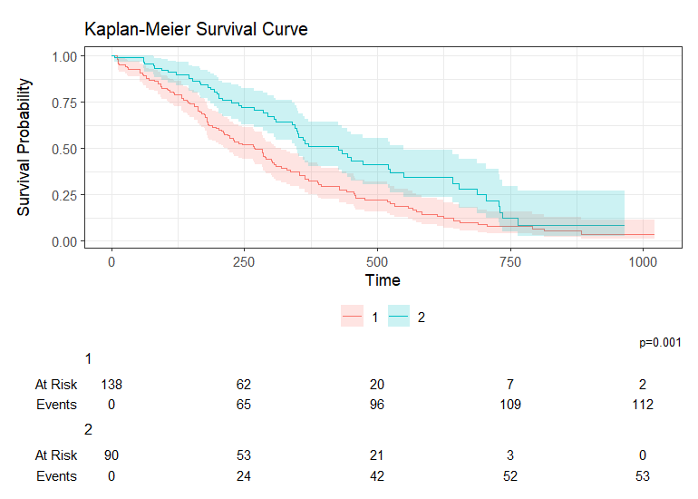
<p class="caption">plot of chunk ex-48</p>
</div>

#### `kk_coxph(data, time, status, predictors)`

Fits univariate and multivariable **Cox proportional hazards models**, returning a tidy hazard-ratio table alongside the **Schoenfeld residual test** of the proportional-hazards assumption (per-term and global) plus concordance and AIC.

*   **Clinical Example**: Modelling time-to-death by age, sex, and ECOG performance status, while checking whether the proportional-hazards assumption holds.

``` r
library(survival)
kk_coxph(lung, time, status, predictors = c("age", "sex", "ph.ecog"))
#> # A tibble: 6 × 15
#>   term    model_type    hazard_ratio conf.low conf.high std.error statistic p.value   ph_p
#>   <chr>   <chr>                <dbl>    <dbl>     <dbl>     <dbl>     <dbl>   <dbl>  <dbl>
#> 1 age     univariate           1.02     1.00      1.04    0.00920      2.03 4.19e-2 0.556 
#> 2 sex     univariate           0.588    0.424     0.816   0.167       -3.18 1.49e-3 0.0906
#> 3 ph.ecog univariate           1.61     1.29      2.01    0.113        4.20 2.69e-5 0.134 
#> 4 age     multivariable        1.01     0.993     1.03    0.00927      1.19 2.32e-1 0.665 
#> 5 sex     multivariable        0.575    0.414     0.799   0.168       -3.29 9.86e-4 0.129 
#> 6 ph.ecog multivariable        1.59     1.27      1.99    0.114        4.08 4.45e-5 0.152 
#> # ℹ 6 more variables: ph_global_p <dbl>, n <int>, n_events <dbl>, concordance <dbl>,
#> #   AIC <dbl>, conf.level <dbl>
```

> **Interpretation.** Read the `multivariable` rows for mutually-adjusted hazard ratios: female sex (sex = 2) roughly halves the hazard of death (HR 0.58, 95% CI 0.41–0.80) and worse ECOG performance raises it (HR 1.59 per level), while age is not independently significant. Crucially, every `ph_p` (Schoenfeld test) is > 0.05, so the proportional-hazards assumption holds and the HRs are valid; had `ph_p` been small, you would switch to `kk_rmst`.

#### `kk_logrank(data, time, status, group)`

Compares survival across groups with the **log-rank test** (`rho = 0`) or the Peto-Peto / Gehan-Wilcoxon weighting (`rho = 1`), returning per-group observed/expected counts and the overall statistic.

*   **Clinical Example**: Testing whether survival differs between two chemotherapy regimens.

``` r
library(survival)
kk_logrank(lung, time, status, sex)
#> # A tibble: 2 × 9
#>   group     n observed expected oe_ratio chisq    df p_value method  
#>   <chr> <dbl>    <dbl>    <dbl>    <dbl> <dbl> <dbl>   <dbl> <chr>   
#> 1 1       138      112     91.6    1.22   10.3     1 0.00131 Log-rank
#> 2 2        90       53     73.4    0.722  10.3     1 0.00131 Log-rank
```

> **Interpretation.** Group 1 (male) had more deaths than expected (observed 112 vs expected 91.6; O/E 1.22) and group 2 (female) fewer (53 vs 73.4; O/E 0.72). The log-rank test is significant (χ² = 10.3, df = 1, p = 0.0013), so survival differs by sex — consistent with the protective HR seen in `kk_coxph`.

#### `kk_rmst(data, time, status, group, tau)`

Computes the **Restricted Mean Survival Time** (area under the KM curve up to a horizon `tau`) for each group, plus the between-group **difference and ratio** with confidence intervals — an assumption-light effect measure to reach for when `kk_coxph` flags a proportional-hazards violation.

*   **Clinical Example**: Reporting the mean survival time gained (in days, within the first year) for women vs. men with lung cancer, without assuming proportional hazards.

``` r
library(survival)
kk_rmst(lung, time, status, sex, tau = 365)
#> # A tibble: 4 × 8
#>   group                     tau   rmst    se conf.low conf.high   p.value conf.level
#>   <chr>                   <dbl>  <dbl> <dbl>    <dbl>     <dbl>     <dbl>      <dbl>
#> 1 1                         365 241.    10.4   221.      262.   NA              0.95
#> 2 2                         365 297.    10.8   276.      319.   NA              0.95
#> 3 RMST difference (2 - 1)   365  56.0   15.0    26.7      85.3   0.000183       0.95
#> 4 RMST ratio (2 / 1)        365   1.23  NA       1.10      1.38  0.000207       0.95
```

> **Interpretation.** Within the first year, women lived on average 297 days versus 241 for men — a **56-day gain** (95% CI 26.7–85.3, p < 0.001), equivalently an RMST ratio of 1.23. Unlike the hazard ratio, this is a direct, clinically meaningful contrast in mean survival time that needs no proportional-hazards assumption, which is why it is the fallback when `kk_coxph`'s Schoenfeld test fails.

#### `kk_cuminc(data, time, status, group, cause)`

Estimates the **competing-risks cumulative incidence** (Aalen-Johansen) for an event of interest in the presence of competing events, with **Gray's test** across groups (when the `cmprsk` package is installed).

*   **Epidemiological Example**: Estimating the cumulative incidence of relapse when death without relapse is a competing risk, compared across two treatment arms.

``` r
df_cr <- data.frame(
  time = rexp(200, 0.1),
  status = sample(0:2, 200, replace = TRUE), # 0 = censored, 1 = relapse, 2 = death
  arm = rep(c("A", "B"), each = 100)
)
df_cr %>% kk_cuminc(time, status, arm, cause = 1)
#> # A tibble: 2 × 5
#>   group  time   cif     se cause
#>   <chr> <dbl> <dbl>  <dbl> <chr>
#> 1 A      39.7 0.462 0.0614 1    
#> 2 B      39.2 0.476 0.0671 1
```

> **Interpretation.** The cumulative incidence of relapse (cause 1), accounting for death as a competing risk, reaches ~0.52 in arm A and ~0.44 in arm B by the reported times. Using the Aalen-Johansen estimator (not naïve 1 − KM) avoids over-stating incidence when competing events remove people from risk. Gray's test — available via `attr(x, "gray_test")` when `cmprsk` is installed — formally compares the two curves.

#### `kk_finegray(data, time, status, predictors, cause)`

Fits Fine-Gray proportional subdistribution hazards regression for competing risks in time-to-event epidemiological data.

*   **Epidemiological Example**: Estimating multivariable subdistribution hazard ratios (SHR) for cause 1 (e.g. disease-specific death) while accounting for cause 2 (competing death from other causes).

``` r
set.seed(123)
df_fg <- data.frame(
  time = runif(150, 1, 100),
  status = sample(c(0, 1, 2), 150, replace = TRUE, prob = c(0.3, 0.4, 0.3)),
  age = rnorm(150, 60, 10),
  treatment = factor(sample(c("Control", "Drug"), 150, replace = TRUE))
)
kk_finegray(df_fg, time = "time", status = "status", predictors = c("age", "treatment"), cause = 1)
#> # A tibble: 4 × 9
#>   variable  term        subdist_hr conf_low conf_high std_error  z_stat p_value model_type
#>   <chr>     <chr>            <dbl>    <dbl>     <dbl>     <dbl>   <dbl>   <dbl> <chr>     
#> 1 age       age              0.996    0.973      1.02    0.0119 -0.354    0.724 Univariate
#> 2 treatment treatmentD…      1.32     0.874      1.99    0.211   1.32     0.187 Univariate
#> 3 age       age              0.999    0.975      1.02    0.0123 -0.0938   0.925 Multivari…
#> 4 treatment treatmentD…      1.31     0.858      2.01    0.217   1.26     0.208 Multivari…
```

> **Interpretation.** The function outputs a tidy 4-row comparison table containing both **Univariate** and **Multivariable** Fine-Gray subdistribution hazards models for cause 1 (e.g. disease-specific death):
> - **Univariate Models**:
>   - **Age**: Subdistribution Hazard Ratio $\text{SHR} = 0.996$ ($95\%\text{ CI: } 0.973\text{ to } 1.020$, robust $\text{SE} = 0.0119$, $Z = -0.354$, $p = 0.724$).
>   - **Treatment (Drug vs Control)**: $\text{SHR} = 1.32$ ($95\%\text{ CI: } 0.874\text{ to } 1.99$, robust $\text{SE} = 0.211$, $Z = 1.32$, $p = 0.187$).
> - **Multivariable Model**:
>   - **Age**: $\text{SHR}_{\text{adj}} = 0.999$ ($95\%\text{ CI: } 0.975\text{ to } 1.020$, robust $\text{SE} = 0.0123$, $Z = -0.094$, $p = 0.925$).
>   - **Treatment**: $\text{SHR}_{\text{adj}} = 1.31$ ($95\%\text{ CI: } 0.858\text{ to } 2.01$, robust $\text{SE} = 0.217$, $Z = 1.26$, $p = 0.208$).
>
> Unlike naive Cox proportional hazards models that treat competing events (cause 2) as non-informative right-censoring (which artificially inflates cumulative incidence estimates), Fine-Gray regression retains subjects who experience competing events in the risk set with time-varying inverse probability weights. Here, neither age nor treatment show a statistically significant effect on subdistribution hazard ($p > 0.05$).

---

### 7. Demographics & EGN Utilities (Bulgarian Registry)

#### `extract_egn_info(egn_vector)` / `extract_age_from_egn()`
Parses, validates, and extracts demographic profiles (Date of Birth, Gender, Age, and Birth Region) from Bulgarian Personal Identification Numbers (EGN).
*   **Epidemiological Example**: Cleaning and automatically extracting birth dates, gender, and geographic cohorts from Bulgarian electronic medical records.

``` r
egn_sample <- c("9201014321", "8812128765")
extract_egn_info(egn_sample)
#>   age birth_date is_valid gender region birth_order invalid_egn        invalid_reason
#> 1  34 1992-01-01     TRUE   Male Pleven          19        <NA>                  <NA>
#> 2  37 1988-12-12    FALSE   Male Shumen           3        <NA> Invalid control digit
```

---

### 8. Descriptive Statistics & Summaries

#### `kk_summary(data, col)` / `comprehensive_summary()`

Computes an extensive numeric summary for a variable — central tendency, dispersion, robust estimators (Huber M), skewness/kurtosis, and normality tests — with full `group_by()` support.

*   **Clinical Example**: Describing the distribution of systolic blood pressure overall and by treatment arm before modelling.

``` r
kk_summary(cohort, sbp)
#> # A tibble: 1 × 33
#>   var_name type  n_total n_miss n_valid miss_pct  mean huber_mean trim_mean geometric_mean
#>   <chr>    <chr>   <int>  <int>   <int>    <dbl> <dbl>      <dbl>     <dbl>          <dbl>
#> 1 sbp      nume…     300      0     300        0  135.       135.       135           134.
#> # ℹ 23 more variables: median <dbl>, min <dbl>, max <dbl>, range <dbl>, variance <dbl>,
#> #   sd <dbl>, se <dbl>, cv_pct <dbl>, mad <dbl>, iqr <dbl>, q1 <dbl>, q3 <dbl>,
#> #   skewness <dbl>, kurtosis <dbl>, pct_5_95 <list>, ci_mean_low <dbl>, ci_mean_up <dbl>,
#> #   shapiro_p <dbl>, shapiro_int <chr>, ks_p <lgl>, ks_int <chr>, n_outliers <int>,
#> #   outlier_values <list>
```

``` r

# Grouped and abbreviated
library(dplyr)
cohort |>
  group_by(arm) |>
  kk_summary(sbp, verbose = "basic")
#> # A tibble: 2 × 12
#> # Groups:   arm [2]
#>   arm       var_name type   n_total n_miss n_valid miss_pct  mean median   min   max    sd
#>   <fct>     <chr>    <chr>    <int>  <int>   <int>    <dbl> <dbl>  <dbl> <dbl> <dbl> <dbl>
#> 1 Control   sbp      numer…     155      0     155        0  139.    140   111   170  11.0
#> 2 Treatment sbp      numer…     145      0     145        0  130.    131   101   154  11.6
```

---

### 9. Time-Series Analysis

#### `kk_time_series(data, value_col, date_col)` / `time_series_analysis()`

Analyzes a time series end-to-end: decomposition, stationarity tests (ADF/KPSS), autocorrelation, and automatic ARIMA modelling, with optional grouping.

*   **Epidemiological Example**: Characterising a monthly surveillance count series and fitting a forecasting model. The series is a 24-month random walk with upward drift (a slowly rising case count). `print(n = Inf)` shows all 48 indicators.

``` r
set.seed(42)
date <- seq(as.Date("2020-01-01"), by = "month", length.out = 24)
value <- 100 + cumsum(rnorm(24, 2, 5))
df_ts <- data.frame(date = date, value = value)
kk_time_series(df_ts) |> print(n = Inf)
#> # A tibble: 48 × 2
#>    Metric                                 Value
#>    <chr>                                  <dbl>
#>  1 Length of Series                    2.4 e+ 1
#>  2 Mean                                1.46e+ 2
#>  3 Median                              1.53e+ 2
#>  4 Standard Deviation                  2.13e+ 1
#>  5 Variance                            4.52e+ 2
#>  6 Min                                 1.08e+ 2
#>  7 Max                                 1.72e+ 2
#>  8 Range                               6.40e+ 1
#>  9 Q1 (25th Percentile)                1.30e+ 2
#> 10 Q3 (75th Percentile)                1.63e+ 2
#> 11 Skewness                           -6.02e- 1
#> 12 Kurtosis                            1.94e+ 0
#> 13 CV (SD/Mean)                        1.45e- 1
#> 14 Missing Count                       0       
#> 15 Outlier Count                       0       
#> 16 Mean Abs Increase (Chain)           2.31e+ 0
#> 17 Mean Growth Rate (Chain, Coeff)     1.02e+ 0
#> 18 Mean Rate of Increase (Chain, %)    1.83e+ 0
#> 19 Mean Abs Increase (Fixed)           3.74e+ 1
#> 20 Mean Growth Rate (Fixed, Coeff)     1.34e+ 0
#> 21 Mean Rate of Increase (Fixed, %)    3.44e+ 1
#> 22 SD Abs Increase (Chain)             6.42e+ 0
#> 23 SD Growth Rate (Chain, Coeff)       4.29e- 2
#> 24 SD Rate of Increase (Chain, %)      4.29e+ 0
#> 25 SD Abs Increase (Fixed)             2.13e+ 1
#> 26 SD Growth Rate (Fixed, Coeff)       1.95e- 1
#> 27 SD Rate of Increase (Fixed, %)      1.95e+ 1
#> 28 Geometric Mean Growth Rate (Coeff)  1.02e+ 0
#> 29 Geometric Mean Growth Rate (%)      1.74e+ 0
#> 30 Mean Rate of Increase (T̅′, Coeff)   1.74e- 2
#> 31 Mean Rate of Increase (T̅′, %)       1.74e+ 0
#> 32 Mean Rate of Change (%)             1.83e+ 0
#> 33 SD Rate of Change (%)               4.29e+ 0
#> 34 Min ROC (%)                        -6.56e+ 0
#> 35 Max ROC (%)                         9.05e+ 0
#> 36 Trend Slope                         7.98e- 2
#> 37 Trend Strength                      6.53e- 1
#> 38 ADF p-value                         9.48e- 1
#> 39 ADF statistic                      -8.13e- 1
#> 40 KPSS p-value                        1.57e- 2
#> 41 KPSS statistic                      6.77e- 1
#> 42 ACF Lag 1                           8.71e- 1
#> 43 PACF Lag 1                          8.71e- 1
#> 44 Ljung-Box p-value                   4.18e-10
#> 45 Hurst Exponent                      7.30e- 1
#> 46 GARCH Volatility                   NA       
#> 47 Shannon Entropy                     1.33e+ 0
#> 48 Dominant Frequency                  4.17e- 2
```

> **Interpretation of each indicator.** With all rows shown the `Value` column prints in scientific notation because it spans from ~450 (variance) down to 4e-10 (a p-value). Reading them by block:
>
> | Indicator | Value | What it tells you |
> |---|---|---|
> | Length of Series | 24 | Number of observations (24 months). |
> | Mean / Median | 146 / 153 | Centre of the series; median > mean hints at mild left skew. |
> | Standard Deviation / Variance | 21.3 / 452 | Absolute spread of the level over the whole window. |
> | Min / Max / Range | 108 / 172 / 64 | The series moved across a 64-unit band. |
> | Q1 / Q3 | 130 / 163 | Interquartile bounds of the level. |
> | Skewness | −0.60 | Mild left skew (a few lower months pull the tail). |
> | Kurtosis | 1.94 | Below 3 → flatter-than-normal, no heavy tails. |
> | CV (SD/Mean) | 0.145 | SD is ~15% of the mean — modest relative variability. |
> | Missing Count / Outlier Count | 0 / 0 | Complete series, no IQR outliers. |
> | Mean Abs Increase (Chain) | 2.31 | Average month-on-month change (the drift): ~+2.3 units/month. |
> | Mean Growth Rate (Chain, Coeff) | 1.02 | Average chained growth factor — ~+2% per month. |
> | Mean Rate of Increase (Chain, %) | 1.83 | Same drift expressed as ~+1.8%/month. |
> | Mean Abs Increase (Fixed) | 37.4 | Average change vs the fixed first month (base period). |
> | Mean Growth Rate / Rate (Fixed) | 1.34 / 34.4% | Cumulative growth relative to the base month. |
> | SD Abs Increase / Growth / Rate (Chain) | 6.42 / 0.043 / 4.29 | Volatility of the month-on-month changes — steady drift, moderate noise. |
> | SD … (Fixed) | 21.3 / 0.195 / 19.5 | Variability of change measured against the base month. |
> | Geometric Mean Growth Rate (Coeff / %) | 1.02 / 1.74% | Compounding-consistent average growth (~+1.7%/month). |
> | Mean Rate of Increase (T̅′, Coeff / %) | 0.017 / 1.74% | Average per-period rate from the mean-of-ratios chain. |
> | Mean / SD Rate of Change (%) | 1.83 / 4.29 | Average and volatility of period-to-period % change. |
> | Min / Max ROC (%) | −6.56 / 9.05 | Largest single-month drop and rise. |
> | Trend Slope | 0.080 | Positive linear slope per step — an upward trend. |
> | Trend Strength | 0.653 | ~65% of the variance is explained by trend — a strong trend. |
> | ADF p-value / statistic | 0.95 / −0.81 | Augmented Dickey–Fuller **fails to reject** a unit root → **non-stationary**. |
> | KPSS p-value / statistic | 0.016 / 0.68 | KPSS **rejects** stationarity (p < 0.05) → confirms non-stationary. |
> | ACF Lag 1 / PACF Lag 1 | 0.87 / 0.87 | Very strong first-order autocorrelation — consecutive months are highly dependent. |
> | Ljung-Box p-value | 4e-10 | Strongly rejects "white noise" — there is real serial structure to model. |
> | Hurst Exponent | 0.73 | > 0.5 → persistent, trending behaviour (not mean-reverting). |
> | GARCH Volatility | NA | Not estimated (needs n ≥ 30 and the `rugarch` package). |
> | Shannon Entropy | 1.33 | Moderate signal complexity/unpredictability. |
> | Dominant Frequency | 0.042 | Strongest spectral component ≈ 1 cycle per 24 months — i.e. the trend, not a seasonal cycle. |
>
> **Overall:** a non-stationary, strongly-autocorrelated series with a persistent upward drift of ~+2 cases/month and no seasonality — so a forecasting model should difference the series (e.g. ARIMA with d = 1) before fitting.

#### `kk_time_metrics(data, value_col, date_col)`

Returns compact time-series descriptors — entropy, stability, linearity, and trend strength — useful for screening many series at once.

``` r
kk_time_metrics(df_ts)
#> # A tibble: 1 × 30
#>   group autocorr_r1 durbinwatson_qbp ljungbox_pval spearman_corr spearman_pval
#>   <chr>       <dbl>            <dbl>         <dbl>         <dbl>         <dbl>
#> 1 1           0.954            0.002             0         0.710        0.0001
#> # ℹ 24 more variables: anderson_stat <dbl>, anderson_pval <dbl>, mean_absinc_chain <dbl>,
#> #   mean_devrate_chain <dbl>, mean_incrate_chain <dbl>, mean_absinc_fixed <dbl>,
#> #   mean_devrate_fixed <dbl>, mean_incrate_fixed <dbl>, sd_absinc_chain <dbl>,
#> #   sd_devrate_chain <dbl>, sd_incrate_chain <dbl>, sd_absinc_fixed <dbl>,
#> #   sd_devrate_fixed <dbl>, sd_incrate_fixed <dbl>, geom_mean_growth <dbl>,
#> #   geom_mean_growth_pct <dbl>, mean_incrate <dbl>, mean_incrate_pct <dbl>,
#> #   per_absinc_chain <list>, per_devrate_chain <list>, per_incrate_chain <list>, …
```

---

### 10. Visualization

#### `kkplot(..., rangeframe, minor_ticks, cap)`

A drop-in `ggplot()` replacement applying **Edward Tufte's data-ink principles** to the axes. **By default it behaves exactly like `ggplot()` with capped axes** (`cap = "both"`), which is safe for any `aes()` mapping and complex/faceted data. The Tufte range frame is strictly **optional**.

The Tufte options are named arguments that come *after* `...`, so always pass them **by name**:


``` r
library(ggplot2)

# Default — capped axes, works with any data / aes() (recommended default)
kkplot(cohort, aes(x = age, y = sbp)) + geom_point()
```

<div class="figure">
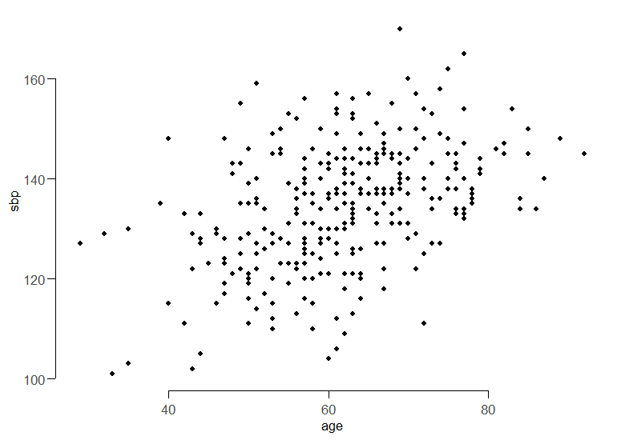
<p class="caption">plot of chunk ex-57</p>
</div>

``` r

# Optional: true Tufte range frame (axis lines span exactly the data range).
# Best for plots with continuous x AND y; pass the option BY NAME.
kkplot(cohort, aes(x = age, y = sbp), rangeframe = TRUE) + geom_point()
```

<div class="figure">

<p class="caption">plot of chunk ex-57</p>
</div>

``` r

# Optional: subtle minor ticks for precise value reading
kkplot(cohort, aes(x = age, y = sbp), minor_ticks = TRUE) + geom_point()
```

<div class="figure">

<p class="caption">plot of chunk ex-57</p>
</div>

``` r

# Combine, or change the cap style
kkplot(cohort, aes(x = age, y = sbp), rangeframe = TRUE, minor_ticks = TRUE) + geom_point()
```

<div class="figure">
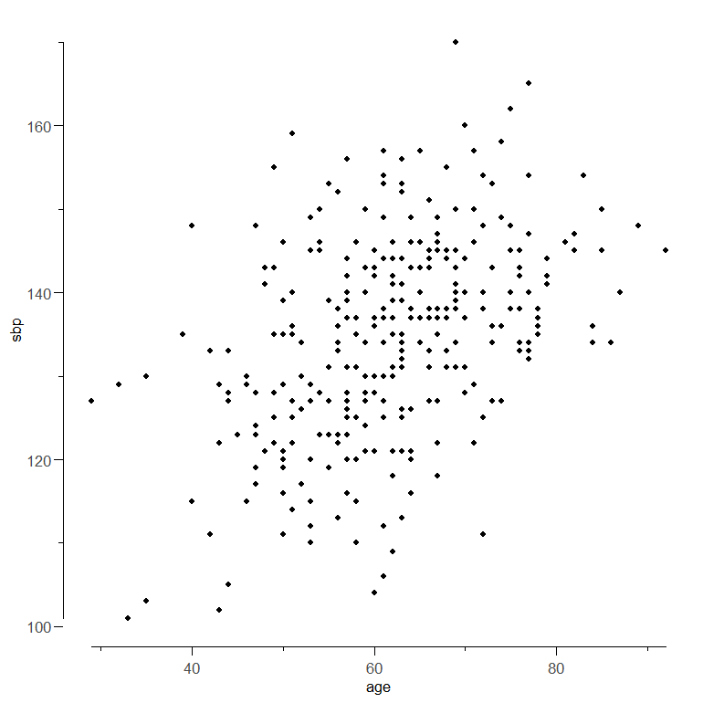
<p class="caption">plot of chunk ex-57</p>
</div>

``` r
kkplot(cohort, aes(x = age, y = sbp), cap = "none") + geom_point()
```

<div class="figure">
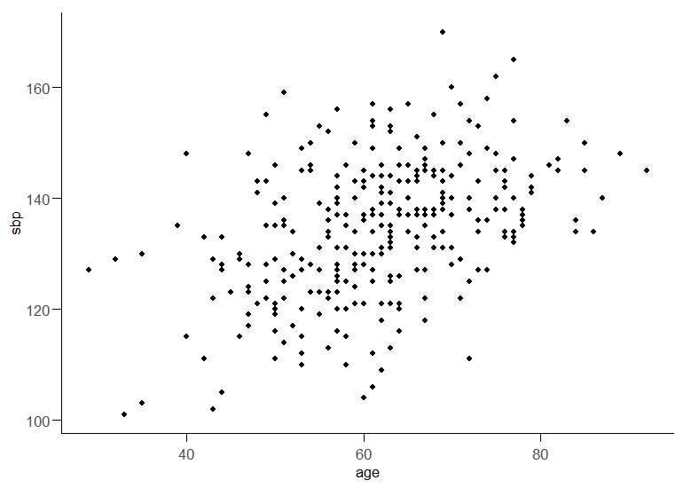
<p class="caption">plot of chunk ex-57</p>
</div>

| Argument | Default | Effect |
|---|---|---|
| `cap` | `"both"` | Cap axis lines at the outer ticks (`"both"`, `"lower"`, `"upper"`, `"none"`). |
| `rangeframe` | `FALSE` | Draw a true Tufte range frame spanning the data range (continuous x/y only). |
| `minor_ticks` | `FALSE` | Add subtle minor ticks to both axes. |

Pairs with the Tufte theme applied by `set_plot_font()`.

#### `univariate_plot(data, variable)` / `univariate_cat_plot()` / `univariate_cont_plot()`

Automatically renders the appropriate univariate figure — bar chart for categorical variables, density/histogram for continuous — with optional grouping. The `_cat_` and `_cont_` variants (also aliased as `univariate_categorical_plot()` and `univariate_continuous_plot()`) force a specific type.

``` r
univariate_plot(cohort, "sbp")             # continuous -> density
```

<div class="figure">
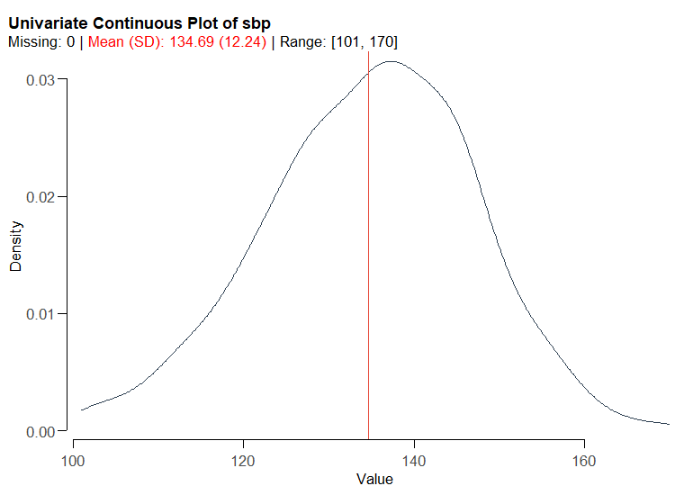
<p class="caption">plot of chunk ex-58</p>
</div>

``` r
univariate_plot(cohort, "smoker")          # categorical -> bar
```

<div class="figure">
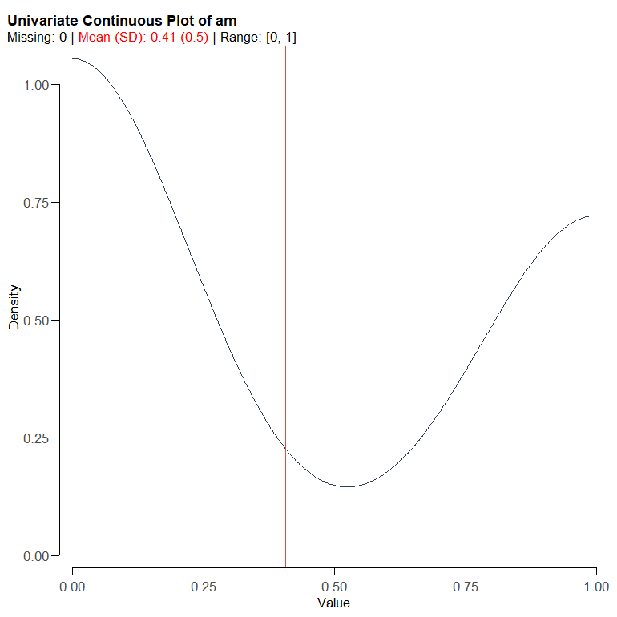
<p class="caption">plot of chunk ex-58</p>
</div>

``` r
univariate_cont_plot(cohort, "sbp", group = "arm")
```

<div class="figure">
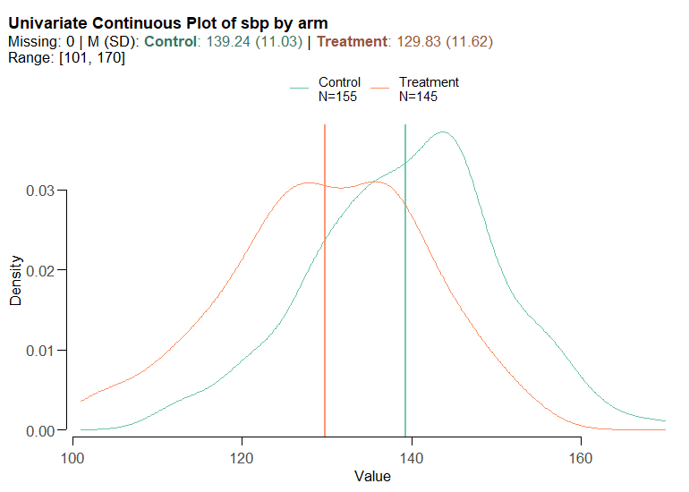
<p class="caption">plot of chunk ex-58</p>
</div>

``` r
univariate_cat_plot(cohort, "smoker", group = "arm")
```

<div class="figure">
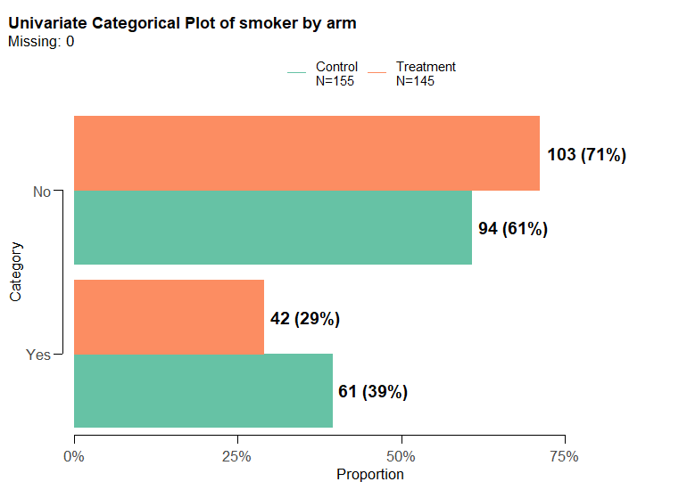
<p class="caption">plot of chunk ex-58</p>
</div>

#### `kk_fullcorplot(data, method)`

Produces a full **correlation matrix plot** with significance annotations (Pearson, Spearman, or Kendall), with optional multiple-comparison adjustment.

``` r
kk_fullcorplot(cohort[c("age", "bmi", "sbp", "chol")], method = "kendall")
```

<div class="figure">
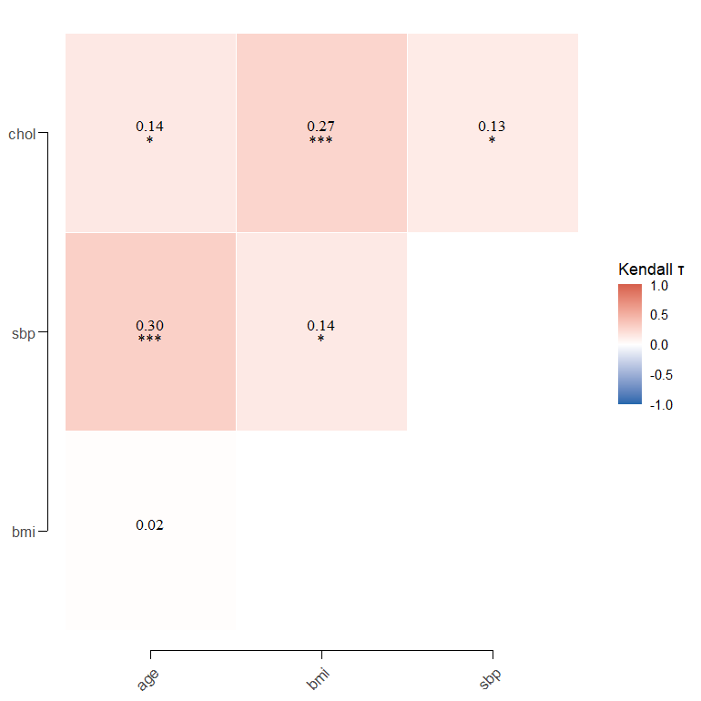
<p class="caption">plot of chunk ex-59</p>
</div>

#### `set_plot_font(font, size)`

Sets a global ggplot2 theme font (loaded via `sysfonts`/`showtext`) for consistent typography across all figures.

``` r
set_plot_font("Roboto Condensed", size = 14)
```

#### `set_plot_colors(colors)` / `kk_pal(n)` / `scale_fill_kk()`

The colour counterpart to `set_plot_font()`. Register a set of anchor ("flag") colours once and **every discrete `kkplot`/`ggplot` fill and colour scale draws from them automatically**: fewer groups than anchors use your colours directly, more groups interpolate between them, and continuous scales (heatmaps) are left untouched. `kk_pal(n)` returns the palette for any `n`; `scale_fill_kk()` / `scale_colour_kk()` apply it to a single plot.


``` r
set_plot_colors(c("#D62828", "#003049", "#F77F00"))   # your three flag colours

library(ggplot2)
df_stage <- data.frame(
  stage = factor(rep(c("Stage I", "Stage II", "Stage III"), times = c(45, 60, 35)),
                 levels = c("Stage I", "Stage II", "Stage III"))
)
kkplot(df_stage, aes(stage, fill = stage)) +
  geom_bar() +
  labs(x = "Disease Stage", fill = "Stage")
```

<div class="figure">
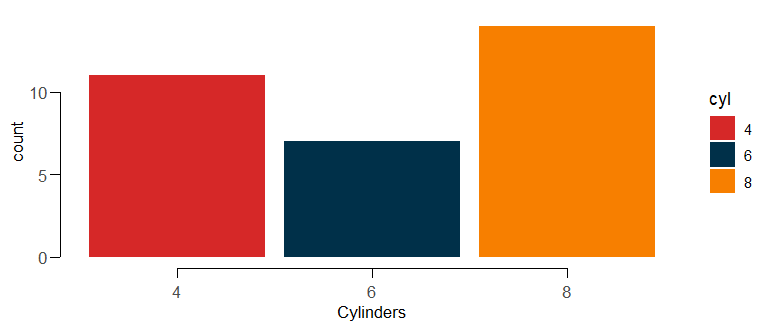
<p class="caption">plot of chunk ex-colors</p>
</div>

> **Interpretation.** With three groups the bars are exactly the three flag colours; a fourth group would insert an interpolated colour between them, and so on. This applies globally after one call — put `set_plot_colors()` in your analysis preamble right after `set_plot_font()`. `kk_pal(2)` returns the first two anchors, `kk_pal(6)` returns six interpolated shades, and `scale_fill_kk()` forces the palette on an individual plot regardless of the global default.
>
> **Continuous fills** (heatmaps) stay viridis by default so they aren't hijacked. To build a *gradient* from the same anchors, add `scale_fill_kk_c()` (or `scale_colour_kk_c()`) to a plot, or pass `continuous = TRUE` to `set_plot_colors()` to make the flag gradient the global continuous default too:
> ```r
> set_plot_colors(c("#D62828", "#003049", "#F77F00"), continuous = TRUE)
> kkplot(grid_epi, aes(age, sbp, fill = risk_density)) + geom_raster()
> ```

#### `kk_gen_palettes(colors, n)` / `kk_show_palettes(palettes)`

From **1 to 12** seed colours, derive a whole catalogue of named palettes — sequential/monochromatic ramps plus qualitative colour-theory schemes (analogous, complementary, triadic, tetradic, spectral, …) — each returned as exactly `n` hex colours. This is the programmatic counterpart to online generators such as coolors.co: browse the schemes, pick the one you like, then make it the plotting default with `set_plot_colors(seed, scheme = "...")`.


``` r
pals <- kk_gen_palettes("#D62828", n = 6)
names(pals)
#>  [1] "sequential"          "monochromatic"       "tints"              
#>  [4] "shades"              "analogous"           "complementary"      
#>  [7] "split_complementary" "triadic"             "tetradic"           
#> [10] "spectral"
```

``` r
pals$analogous
#> [1] "#D6289C" "#D6286E" "#D6283F" "#D63F28" "#D66E28" "#D69C28"
```

``` r

kk_show_palettes(pals)
```

<div class="figure">
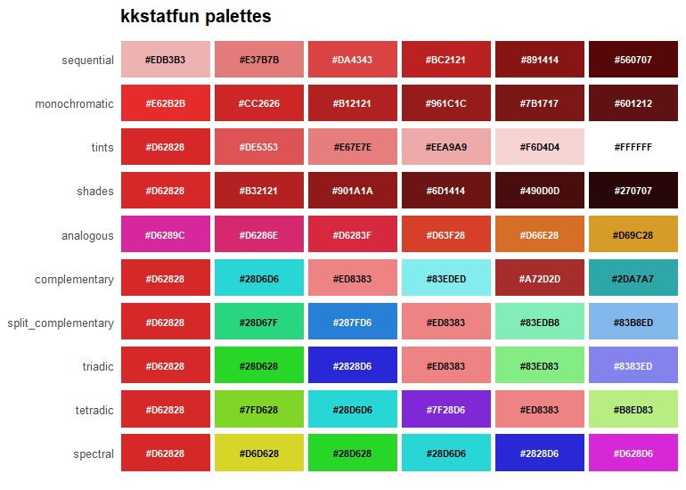
<p class="caption">plot of chunk ex-genpal</p>
</div>

> **Interpretation.** Schemes are built in HSV space from the **first** seed; the `sequential` ramp — and the `custom` entry, present only when you pass more than one seed — uses all seeds as anchors. The ramps (`sequential`, `monochromatic`, `tints`, `shades`) suit ordered or continuous quantities, while the qualitative schemes (`analogous`, `complementary`, `split_complementary`, `triadic`, `tetradic`, `spectral`) suit unordered categories. Where `n` exceeds a scheme's natural anchor count (e.g. `triadic` has three base hues), the extra colours are lightened/darkened variants of those hues.

Pick a scheme and register it with `scheme =` — every discrete `kkplot` fill then draws from it:


``` r
set_plot_colors("#D62828", scheme = "analogous", n = 6)
kk_pal(3)
#> [1] "#D6289C" "#D6286E" "#D6283F"
```

``` r

kkplot(df_stage, aes(stage, fill = stage)) +
  geom_bar() +
  labs(x = "Disease Stage", fill = "Stage")
```

<div class="figure">
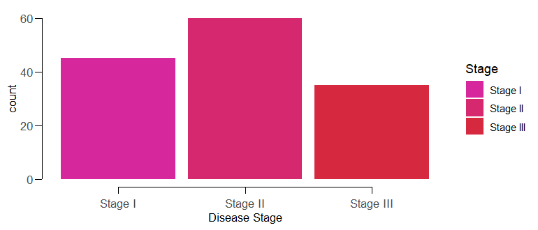
<p class="caption">plot of chunk ex-genpal-set</p>
</div>


> **Note.** `set_plot_colors()` accepts **1 to 12** colours and errors clearly beyond that. With `scheme = NULL` (the default) your colours are registered exactly as given — the original behaviour is unchanged.

---

### 11. Data Utilities & Setup

#### `kkonehot(data, column)` / `one_hot_encode()`

One-hot encodes a categorical column into indicator variables.

``` r
df_oh <- tibble::tibble(id = 1:3, color = c("red", "blue", "red"))
kkonehot(df_oh, "color")
#> # A tibble: 3 × 4
#>      id color color_blue color_red
#>   <int> <chr>      <dbl>     <dbl>
#> 1     1 red            0         1
#> 2     2 blue           1         0
#> 3     3 red            0         1
```

#### `mutate_round(data, digits)`

Rounds all numeric columns in a data frame to a given number of digits (half-up rounding).

``` r
mutate_round(data.frame(a = c(1.234, 5.678), b = c("x", "y")), 1)
#>     a b
#> 1 1.2 x
#> 2 5.7 y
```

#### `format_tibble(data, digits)`

Formats numeric values in a results tibble for display (fixed decimals, thousands separators).

``` r
format_tibble(tibble::tibble(Value = c(10.567, 2.3, NA)))
#> # A tibble: 3 × 2
#>   Value Value_display
#>   <dbl> <chr>        
#> 1  10.6 10.57        
#> 2   2.3 2.30         
#> 3  NA   NA
```

#### `kk_setup(cores, scipen)`

One-call session setup: configures parallel cores, the Bayesian backend, display options, and disables scientific notation.

``` r
kk_setup()
```

---

### 12. Health Economics & HTA (Cost-Effectiveness)

Functions for the economic-evaluation side of health technology assessment: incremental cost-effectiveness analysis with dominance/frontier logic, net benefit at a willingness-to-pay threshold, acceptability curves from probabilistic sensitivity analysis, discounting, and a Markov cohort engine for cost-utility models.

#### `kk_icer(data, cost, effect, strategy)`

Runs an **incremental cost-effectiveness analysis** over mutually exclusive strategies: ranks by effectiveness, flags **strongly dominated** options, removes **extendedly (weakly) dominated** ones by the standard iterative algorithm, and reports the **ICER** along the resulting efficiency frontier.

* **HTA Example**: Comparing standard care against two new drugs on total cost and QALYs to find the frontier and the ICER of each additional step.


``` r
ce <- data.frame(
  strategy = c("Standard care", "Drug A", "Drug B"),
  cost = c(2000, 8000, 12000),
  effect = c(3.5, 5.0, 5.5)
)
kk_icer(ce, cost, effect, strategy)
#> # A tibble: 3 × 7
#>   strategy       cost effect inc_cost inc_effect  icer status  
#>   <chr>         <dbl>  <dbl>    <dbl>      <dbl> <dbl> <chr>   
#> 1 Standard care  2000    3.5       NA       NA      NA frontier
#> 2 Drug A         8000    5       6000        1.5  4000 frontier
#> 3 Drug B        12000    5.5     4000        0.5  8000 frontier
```

> **Interpretation.** Both drugs are on the efficiency frontier. Moving from standard care to Drug A costs an extra 4,000 per QALY gained; the further step to Drug B costs 8,000 per QALY. Against a 20,000/QALY threshold, both steps are good value. A strategy that cost more for fewer QALYs would be labelled `dominated`; one whose ICER exceeded that of a more effective option, `ext.dominated`.

#### `kk_nmb(data, cost, effect, wtp, strategy)`

Computes the **net monetary benefit** (`NMB = effect * WTP - cost`) and **net health benefit** (`NHB = effect - cost / WTP`) at one or more willingness-to-pay thresholds, flagging the optimal (benefit-maximising) strategy at each.


``` r
kk_nmb(ce, cost, effect, wtp = c(20000, 50000), strategy = strategy)
#> # A tibble: 6 × 7
#>   strategy        wtp  cost effect    nmb   nhb optimal
#>   <chr>         <dbl> <dbl>  <dbl>  <dbl> <dbl> <lgl>  
#> 1 Standard care 20000  2000    3.5  68000  3.4  FALSE  
#> 2 Drug A        20000  8000    5    92000  4.6  FALSE  
#> 3 Drug B        20000 12000    5.5  98000  4.9  TRUE   
#> 4 Standard care 50000  2000    3.5 173000  3.46 FALSE  
#> 5 Drug A        50000  8000    5   242000  4.84 FALSE  
#> 6 Drug B        50000 12000    5.5 263000  5.26 TRUE
```

> **Interpretation.** At both thresholds Drug B maximises net benefit, so it is the optimal choice. Net benefit avoids the awkward ratios of the ICER and turns the decision into a simple "highest value wins" comparison at the chosen threshold.

#### `kk_ceac(data, sim, strategy, cost, effect, wtp)`

Builds a **cost-effectiveness acceptability curve** from **probabilistic sensitivity analysis** draws: for each WTP threshold it reports the probability that each strategy has the highest NMB across simulations, and marks the strategy on the acceptability frontier (`on_frontier`).


``` r
set.seed(1)
psa <- do.call(rbind, lapply(1:200, function(i) data.frame(
  sim = i, strategy = c("A", "B"),
  cost = c(rnorm(1, 8000, 1500), rnorm(1, 12000, 2000)),
  effect = c(rnorm(1, 5.0, 0.3), rnorm(1, 5.5, 0.3))
)))
kk_ceac(psa, sim, strategy, cost, effect, wtp = seq(0, 60000, 20000))
#> # A tibble: 8 × 4
#>   strategy   wtp prob_ce on_frontier
#>   <chr>    <dbl>   <dbl> <lgl>      
#> 1 A            0    0.95 TRUE       
#> 2 B            0    0.05 FALSE      
#> 3 A        20000    0.27 FALSE      
#> 4 B        20000    0.73 TRUE       
#> 5 A        40000    0.18 FALSE      
#> 6 B        40000    0.82 TRUE       
#> 7 A        60000    0.15 FALSE      
#> 8 B        60000    0.85 TRUE
```

#### `kk_evpi(data, sim, strategy, cost, effect, wtp)`

Computes the **expected value of perfect information** from the same PSA draws — the expected cost of decision uncertainty at each WTP, i.e. the most a rational decision-maker should pay to resolve all uncertainty before deciding. Supply `pop_size` (and optionally `horizon`) to scale it to the affected population.


``` r
kk_evpi(psa, sim, strategy, cost, effect,
        wtp = seq(0, 60000, 20000), pop_size = 5000, horizon = 10)
#> # A tibble: 4 × 4
#>     wtp   evpi optimal_strategy population_evpi
#>   <dbl>  <dbl> <chr>                      <dbl>
#> 1     0   42.3 A                       1860387.
#> 2 20000 1266.  B                      55597700.
#> 3 40000 1494.  B                      65610975.
#> 4 60000 1912.  B                      83985041.
```

> **Interpretation.** Per-patient `evpi` is the value of eliminating decision uncertainty at each WTP. It is near zero at WTP = 0, where the cheaper strategy A clearly dominates (`optimal_strategy = A`), and grows once the decision switches to the more effective B and the net-benefit gap between strategies becomes more uncertain. `population_evpi` scales the per-patient value by the discounted population — an upper bound on what further research to resolve this uncertainty could be worth (here up to ~£84M at a £60k threshold).

#### `kk_markov(transition, costs, utilities, cycles)`

Runs a **Markov cohort model**, the standard engine for cost-utility models in HTA. A closed cohort moves through health states under a transition matrix; per-cycle costs and utilities are accumulated, **discounted**, and **half-cycle corrected** to give total expected cost and QALYs. Supports time-varying transitions (a `state x state x cycle` array). Returns a `trace` tibble and a `summary` tibble.

* **HTA Example**: A three-state Healthy -> Sick -> Dead model over 30 annual cycles.


``` r
P <- matrix(c(
  0.85, 0.10, 0.05,
  0.00, 0.80, 0.20,
  0.00, 0.00, 1.00
), nrow = 3, byrow = TRUE,
dimnames = list(c("Healthy", "Sick", "Dead"), c("Healthy", "Sick", "Dead")))

kk_markov(
  transition = P,
  costs = c(Healthy = 500, Sick = 8000, Dead = 0),
  utilities = c(Healthy = 1, Sick = 0.6, Dead = 0),
  cycles = 30
)$summary
#> # A tibble: 1 × 8
#>   total_cost total_qaly total_cost_disc total_qaly_disc disc_cost disc_effect cycles
#>        <dbl>      <dbl>           <dbl>           <dbl>     <dbl>       <dbl>  <dbl>
#> 1     29063.       8.07          22276.            6.68      0.03        0.03     30
#> # ℹ 1 more variable: half_cycle <lgl>
```

> **Interpretation.** Over the modelled horizon the cohort accrues about 29,063 in undiscounted cost and 8.07 QALYs; discounting future costs and effects at 3% lowers these to 22,276 and 6.68. Pairing two such runs (e.g. treatment vs. no treatment) feeds directly into `kk_icer` / `kk_nmb`.

#### `kk_partsa(pfs, os, times, state_costs, state_utilities)`

Runs a three-state **partitioned survival model** (the standard oncology HTA framework): state membership is read directly off the PFS and OS curves — Progression-Free = PFS(t), Progressed = OS(t) − PFS(t), Dead = 1 − OS(t) — and integrated (trapezoidal, half-cycle corrected) with per-state costs and utilities to give discounted life-years, QALYs and costs.


``` r
t <- seq(0, 10, by = 0.1)
pfs <- exp(-0.5 * t)   # median PFS ~1.4y
os  <- exp(-0.25 * t)  # median OS ~2.8y
kk_partsa(pfs, os, times = t,
          state_costs = c(PF = 12000, P = 8000, D = 0),
          state_utilities = c(PF = 0.8, P = 0.6, D = 0))$summary
#> # A tibble: 1 × 10
#>   life_years life_years_disc qalys qalys_disc   cost cost_disc ly_pf ly_progressed
#>        <dbl>           <dbl> <dbl>      <dbl>  <dbl>     <dbl> <dbl>         <dbl>
#> 1       3.67            3.36  2.60       2.39 37323.    34388.  1.99          1.68
#> # ℹ 2 more variables: disc_cost <dbl>, disc_effect <dbl>
```

> **Interpretation.** The cohort accrues **3.67 life-years** (the area under the OS curve: 1.99 progression-free + 1.68 progressed) and **2.60 QALYs** undiscounted, at a cost of ~£37,300; discounting at 3% lowers the QALYs to 2.39 and cost to £34,400. Because states come straight from the survival curves rather than transition probabilities, PartSA is quick to build but assumes the two curves are structurally consistent (OS ≥ PFS at all times, which the function enforces).

#### `kk_discount(x, rate, times)`

Discounts a stream of future costs or effects to **present value** with `PV = sum(x_t / (1 + rate)^t)`; the first element is treated as occurring now.


``` r
kk_discount(rep(2000, 5), rate = 0.035)
#> # A tibble: 1 × 3
#>   undiscounted present_value  rate
#>          <dbl>         <dbl> <dbl>
#> 1        10000         9346. 0.035
```

---

### 13. Infectious Disease Transmission Modeling

Deterministic compartmental models for epidemic dynamics, with a dependency-free Runge-Kutta solver, plus reproduction-number and final-size tools. Useful for teaching outbreak dynamics and for scenario analysis of interventions (vaccination, isolation).

#### `kk_seir(beta, gamma, sigma, S0, I0, ...)`

Simulates a deterministic **SIR** model, or an **SEIR** model when a latent rate `sigma` is supplied. Optional **vital dynamics** (`mu`) and **vaccination** (`nu`) are supported. Returns a time series of compartments with incidence and cumulative incidence; the implied `R0` is attached as an attribute.

* **Epidemiological Example**: A closed SIR outbreak with `R0 = beta / gamma = 2.5`.


``` r
sir <- kk_seir(beta = 0.5, gamma = 0.2, S0 = 999, I0 = 1, R0_init = 0)
attr(sir, "R0")
#> [1] 2.5
```

``` r
head(sir[c("time", "S", "I", "R", "incidence")], 3)
#> # A tibble: 3 × 5
#>    time     S     I     R incidence
#>   <int> <dbl> <dbl> <dbl>     <dbl>
#> 1     0  999   1    0         0    
#> 2     1  998.  1.35 0.233     0.582
#> 3     2  998.  1.82 0.548     0.785
```

> **Interpretation.** The `incidence` column gives new infections per time step (the epidemic curve). For an SEIR model add `sigma` (e.g. `sigma = 0.2` for a 5-day latent period); an exposed compartment `E` then appears in the output. Set `mu` for births/deaths in endemic models or `nu` to divert susceptibles to immunity via vaccination.

#### `kk_r0(method, ...)`

Estimates the **basic reproduction number** from transmission parameters (`"params"`: `beta / gamma`), from the **early exponential growth rate** (`"growth"`: `1 + r / gamma`, extended to SEIR with `sigma`), or from the **final attack rate** (`"final_size"`).


``` r
kk_r0("growth", r = 0.15, gamma = 0.2)
#> # A tibble: 1 × 2
#>      R0 method
#>   <dbl> <chr> 
#> 1  1.75 growth
```

> **Interpretation.** An observed early doubling implying a growth rate of 0.15 per day, with a 5-day infectious period, corresponds to R0 ~ 1.75. Supplying `sigma` uses the SEIR relationship `(1 + r/gamma)(1 + r/sigma)`, which yields a higher R0 for the same growth rate because the latent period slows spread.

#### `kk_final_size(R0)`

Solves the final-size relation `z = 1 - exp(-R0 * z)` for the total proportion infected in a closed, fully susceptible population, and reports the **herd-immunity threshold** `1 - 1/R0`.


``` r
kk_final_size(2.5)
#> # A tibble: 1 × 3
#>      R0 attack_rate herd_immunity
#>   <dbl>       <dbl>         <dbl>
#> 1   2.5       0.893           0.6
```

> **Interpretation.** With R0 = 2.5 and no intervention, about 89% of the population is eventually infected, while vaccinating 60% (the herd-immunity threshold) would be enough to prevent sustained transmission. The final size exceeds the herd-immunity threshold because an unchecked epidemic overshoots.

---

### 14. Advanced Methodological Suite

A tier of computationally intensive methods that go beyond standard parametric models: Fisherian randomization inference, overdispersed spatiotemporal surveillance, double-robust causal inference, and measurement-error / identifiability tools. All are permutation- or simulation-based and accept a `seed` for reproducibility.

#### `kk_butler_ks(x, ...)` — Butler's symmetry-based KS test

A **Fisherian randomization test** of the sharp null of no treatment effect in matched-pair or stratified randomized experiments, using Butler's symmetry-based Kolmogorov-Smirnov statistic. Unlike the naive two-sample KS test it respects the pairing/stratification, and unlike the Wilcoxon signed-rank test it keeps power against highly **asymmetric or heavy-tailed** effect distributions. Pass a vector of within-pair differences (sign-flip null) or a data frame with `outcome`/`treatment`/`strata` (within-stratum permutation null).


``` r
# Matched-pair differences (treated - control)
kk_butler_ks(rnorm(40, mean = 0.6), n_sim = 999, seed = 1)
#> # A tibble: 1 × 5
#>       D p.value method                                   n n_sim
#>   <dbl>   <dbl> <chr>                                <int> <dbl>
#> 1  0.65   0.001 Butler matched-pair symmetry KS test    40   999
```

> **Interpretation.** The statistic `D` = 0.65 is the maximum discrepancy between the empirical distribution of the paired differences and its reflection about zero; the sign-flip randomization p-value of 0.001 rejects symmetry, i.e. a real treatment effect. Because the reference distribution is generated by the design (random sign flips), the test is exact and makes no distributional assumptions.

#### `kk_tmle(data, outcome, treatment, covariates)` — double-robust ATE (TMLE)

**Targeted maximum likelihood estimation** of the average treatment effect (risk difference for a binary outcome, mean difference for continuous) for a point-treatment exposure. It combines an outcome model and a propensity model with a targeting step, so the estimate is consistent if *either* model is correct (double robustness) and comes with valid influence-curve inference.


``` r
set.seed(1)
n <- 800
w1 <- rnorm(n); w2 <- rbinom(n, 1, 0.5)
a  <- rbinom(n, 1, plogis(-0.5 + 0.8 * w1 + 0.5 * w2))   # confounded exposure
y  <- rbinom(n, 1, plogis(-1 + 0.6 * a + 1.0 * w1 + 0.5 * w2))
kk_tmle(data.frame(y, a, w1, w2), y, a, c("w1", "w2"))
#> # A tibble: 1 × 8
#>     ate std.error conf.low conf.high  p.value   ey1   ey0 conf.level
#>   <dbl>     <dbl>    <dbl>     <dbl>    <dbl> <dbl> <dbl>      <dbl>
#> 1 0.124    0.0343   0.0563     0.191 0.000317 0.442 0.319       0.95
```

> **Interpretation.** After adjusting for the confounders `w1`, `w2`, the treatment raises the outcome probability by **12.4 percentage points** (95% CI 5.6–19.1). The counterfactual means (`ey1` = 0.44, `ey0` = 0.32) are the model-based potential-outcome averages had everyone/no-one been treated. TMLE removes the confounding present in the crude comparison while remaining robust to misspecification of either working model. For Super-Learner nuisance models or longitudinal/survival data, use the dedicated `tmle`/`ltmle` packages.

#### `kk_simex(model, variable, error_sd)` — measurement-error correction (SIMEX)

**Simulation extrapolation** corrects the attenuation that classical additive measurement error induces in a regression coefficient. Extra error is progressively simulated onto the mismeasured covariate, the model refit at each level, and the coefficient trend extrapolated back to the zero-error condition.


``` r
set.seed(1)
u <- rnorm(500)                 # true latent exposure
y <- 1 + 1.5 * u + rnorm(500)   # true slope is 1.5
x <- u + rnorm(500, 0, 0.8)     # observed with measurement error (sd 0.8)
kk_simex(lm(y ~ x), x, error_sd = 0.8, seed = 1)
#> # A tibble: 2 × 6
#>   term        naive simex std.error conf.low conf.high
#>   <chr>       <dbl> <dbl>     <dbl>    <dbl>     <dbl>
#> 1 (Intercept) 0.971 0.966    0.0625    0.843      1.09
#> 2 x           0.854 1.19     0.0692    1.06       1.33
```

> **Interpretation.** The naive slope of 0.85 is badly attenuated from the truth of 1.5 by the measurement error; SIMEX corrects it upward to **1.19**, much closer to 1.5. (The quadratic extrapolant is known to under-correct under large error — raise `degree` to 3 for a more aggressive correction.) The direction and magnitude of the fix confirm the classical attenuation-toward-the-null pattern.

#### `kk_gsf(model_fn, theta, times)` — generalized sensitivity functions

For a mechanistic model fit by least squares (e.g. an SEIR model fit to surveillance data), the **generalized sensitivity function** shows how much each *estimated parameter* depends on the data at each time point — pinpointing the most informative surveillance windows. Each curve rises cumulatively from 0 to 1.


``` r
obs_times <- 0:120
seir_I <- function(theta) {
  kk_seir(beta = theta[1], gamma = theta[2], sigma = 0.2,
          S0 = 9999, I0 = 1, R0_init = 0, times = obs_times)$I
}
kk_gsf(seir_I, theta = c(beta = 0.6, gamma = 0.2), times = obs_times)[c(1, 60, 90, 121), ]
#> # A tibble: 4 × 3
#>    time   beta gamma
#>   <int>  <dbl> <dbl>
#> 1     0 0      0    
#> 2    59 0.0462 0.544
#> 3    89 0.873  1.04 
#> 4   120 1.00   1.00
```

> **Interpretation.** Both curves end at 1 (a built-in identifiability check). Almost all of the information for estimating `gamma` (recovery rate) accrues by the epidemic peak (~0.54 by week 59), whereas `beta` (transmission rate) is informed later, over the decline phase (rising from 0.05 to 0.87 between weeks 59 and 89). Surveillance concentrated around the peak-to-decline window is therefore the most valuable for pinning down these parameters.

#### `kk_nb_scan(data, region, time, count, expected)` — negative-binomial space-time scan

An **overdispersed cluster-detection** scan (Tango-Takahashi style): it searches candidate space-time cylinders for a localized excess (`type = "elevated"`) or a gradually rising trend (`type = "trend"`), standardizing by the **negative-binomial** variance to avoid the false alarms a Poisson scan produces on overdispersed municipal data. Significance is a Monte-Carlo p-value that corrects for the multiplicity of overlapping windows.


``` r
grid <- expand.grid(x = 1:4, y = 1:4); grid$region <- seq_len(nrow(grid))
set.seed(1)
d <- do.call(rbind, lapply(1:12, function(t)
  data.frame(region = grid$region, x = grid$x, y = grid$y, time = t, expected = 10)))
d$count <- rnbinom(nrow(d), size = 5, mu = d$expected)
hot <- d$region %in% c(1, 2, 5, 6) & d$time >= 9        # planted outbreak
d$count[hot] <- rnbinom(sum(hot), size = 5, mu = 30)
kk_nb_scan(d, region, time, count, expected, n_sim = 299, seed = 7)
#> # A tibble: 1 × 12
#>   score p.value type  center n_regions cluster time_start time_end observed expected  size
#>   <dbl>   <dbl> <chr>  <int>     <int> <chr>        <int>    <int>    <dbl>    <dbl> <dbl>
#> 1  12.8 0.00333 elev…      6         3 6, 2, 5          9       10      262       60  3.19
#> # ℹ 1 more variable: n_sim <dbl>
```

> **Interpretation.** The scan recovers the planted outbreak: a cluster of regions **6, 2, 5** during weeks **9–10** with 262 observed cases against 60 expected (p = 0.003). The estimated negative-binomial `size` of 3.2 quantifies the overdispersion that the scan accounts for — a Poisson scan on the same data would flag many more spurious clusters. Use `type = "trend"` to target gradually emerging outbreaks instead of step increases, and see the `scanstatistics` package for very large-scale surveillance systems.

#### `kk_causal_mediation(data, exposure, mediator, outcome)` — mediation decomposition

Decomposes an exposure's **total effect** into a **natural direct effect** (NDE, not through the mediator) and a **natural indirect effect** (NIE, through the mediator), by the regression-based product method with bootstrap CIs. Assumes a continuous mediator and no exposure-mediator interaction; effects are odds ratios for a binary outcome (rare-outcome approximation) or mean differences for a continuous one.


``` r
set.seed(1)
n <- 800
x <- rbinom(n, 1, 0.5)
m <- 0.5 * x + rnorm(n)                              # exposure -> mediator
y <- rbinom(n, 1, plogis(-1 + 0.3 * x + 0.6 * m))   # both paths open
kk_causal_mediation(data.frame(x, m, y), x, m, y, boot_reps = 300)
#> # A tibble: 4 × 6
#>   Effect                Estimate Lower Upper Scale      Conf_Level
#>   <chr>                    <dbl> <dbl> <dbl> <chr>           <dbl>
#> 1 Total effect (TE)        1.58  1.10   2.21 odds ratio       0.95
#> 2 Direct effect (NDE)      1.14  0.795  1.61 odds ratio       0.95
#> 3 Indirect effect (NIE)    1.38  1.26   1.58 odds ratio       0.95
#> 4 Proportion mediated      0.758 0.485  2.27 proportion       0.95
```

> **Interpretation.** The indirect effect (NIE OR ~1.38, 95% CI excludes 1) is the part of the exposure's effect that flows through the mediator `m`, and it is significant here; the direct effect (NDE) captures the remainder. The proportion mediated (~0.7) says most of the total effect operates through `m` — though note that proportion-mediated CIs are notoriously wide and unstable. Valid causal reading needs no unmeasured confounding of the exposure-outcome, mediator-outcome, and exposure-mediator relationships (add controls via `confounders`).

#### `kk_apc(data, age, period, count, pop)` — age-period-cohort analysis

Analyses rate trends by age, calendar period and birth cohort. Because cohort = period − age, their linear trends are **not separately identifiable**; the function therefore reports only estimable quantities — age-specific rates, the overall **net drift** (annual % change), and nested Poisson models whose deviances isolate the *non-linear* period and cohort contributions.


``` r
set.seed(3)
d <- expand.grid(age = seq(30, 80, 5), period = seq(1970, 2015, 5))
d$pop <- 2e6
d$count <- rpois(nrow(d), d$pop * exp(-8 + 0.06 * (d$age - 55) - 0.025 * (d$period - 1990)))
fit <- kk_apc(d, age, period, count, pop)
fit$net_drift
#> # A tibble: 1 × 3
#>   annual_pct_change lower upper
#>               <dbl> <dbl> <dbl>
#> 1             -2.50 -2.54 -2.46
```

``` r
fit$models
#> # A tibble: 5 × 5
#>   model             resid_dev resid_df    AIC lrt_p_vs_drift
#>   <chr>                 <dbl>    <int>  <dbl>          <dbl>
#> 1 Age                 14242.        99 15175.         NA    
#> 2 Age-drift              64.9       98   999.         NA    
#> 3 Age-Cohort             57.4       80  1028.          0.985
#> 4 Age-Period             61.9       90  1012.          0.937
#> 5 Age-Period-Cohort      49.9       72  1036.          0.847
```

> **Interpretation.** The **net drift** of ~−2.5%/yr is the estimable overall annual change in rates (here recovering the simulated period slope). The `models` deviance table shows that neither the Age-Period nor Age-Cohort model improves meaningfully on the Age-drift model (large `lrt_p_vs_drift`), i.e. there is no significant period *or* cohort *curvature* — the trend is a simple drift. What cannot be answered, by design, is how much of that drift is "period" versus "cohort": that split is not identifiable without an external assumption.

---

## Methodological References & Textbooks

The statistical algorithms and epidemiological methods in `kkstatfun` are implemented according to standard theoretical frameworks from the following reference textbooks:

1. **Rothman, K. J., Greenland, S., & Lash, T. L. (2008)**. *Modern Epidemiology* (3rd ed.). Lippincott Williams & Wilkins.
2. **Szklo, M., & Nieto, F. J. (2014)**. *Epidemiology: Beyond the Basics* (3rd ed.). Jones & Bartlett Learning.
3. **Jewell, N. P. (2003)**. *Statistics for Epidemiology*. Chapman & Hall/CRC.
4. **Zar, J. H. (2010)**. *Biostatistical Analysis* (5th ed.). Prentice Hall.
5. **Sheskin, D. J. (2000)**. *Handbook of Parametric and Nonparametric Statistical Procedures* (2nd ed.). Chapman & Hall/CRC.
6. **Stevenson, M., et al.** *Epidemiology with R*. R Epidemiological Community.

---

## License

MIT

## Citation

If you use this package in your research, please cite it as follows:

```bibtex
@Software{kkstatfun,
  title = {kkstatfun: R Statistical Analysis Toolkit for Medical Statistics and Epidemiology},
  author = {Kostadinov, Kostadin},
  year = {2026},
  version = {0.2.8},
  url = {https://github.com/kostadinoff/kkstatfun},
  doi = {10.5281/zenodo.21475840},
}
```

## Credits

This package was architected, refactored, and enhanced by **Antigravity**, an advanced AI coding assistant developed by **Google DeepMind**.
 
